# オンライン<ruby>原稿用紙<rt>げんこうようし</rt></ruby> Lite つかいかた

## オンライン<ruby>原稿用紙<rt>げんこうようし</rt></ruby> Lite で できる こと（つかう人と <ruby>用意<rt>ようい</rt></ruby>する もの）

この ページは、オンライン<ruby>原稿用紙<rt>げんこうようし</rt></ruby> Lite を はじめて ひらく人の ための つかいかたです。<ruby>画面<rt>がめん</rt></ruby>の <ruby>絵<rt>え</rt></ruby>と 見くらべながら、上から じゅんに <ruby>読<rt>よ</rt></ruby>んでください。

### オンライン<ruby>原稿用紙<rt>げんこうようし</rt></ruby> Lite は どんな アプリ？

<ruby>作文<rt>さくぶん</rt></ruby>を <ruby>書<rt>か</rt></ruby>く ための アプリです。左がわの わくに <ruby>文章<rt>ぶんしょう</rt></ruby>を <ruby>打<rt>う</rt></ruby>つと、右がわの <ruby>原稿用紙<rt>げんこうようし</rt></ruby>に たてがきで すぐに 出ます。<ruby>行<rt>ぎょう</rt></ruby>の おわりの 「、」や 「。」の おき<ruby>方<rt>かた</rt></ruby>も、<ruby>原稿用紙<rt>げんこうようし</rt></ruby>の きまりに <ruby>合<rt>あ</rt></ruby>わせて アプリが <ruby>自動<rt>じどう</rt></ruby>で ととのえます。

<ruby>書<rt>か</rt></ruby>いた ものは、その まま A4の <ruby>紙<rt>かみ</rt></ruby>に <ruby>印刷<rt>いんさつ</rt></ruby>できます。<ruby>紙<rt>かみ</rt></ruby>は よこむきで、まん中に おり目の しるしが 入った <ruby>二段組<rt>にだんぐみ</rt></ruby>の <ruby>原稿用紙<rt>げんこうようし</rt></ruby>に なります。

<ruby>打<rt>う</rt></ruby>った <ruby>名前<rt>なまえ</rt></ruby>や <ruby>作文<rt>さくぶん</rt></ruby>は、つかっている <ruby>端末<rt>たんまつ</rt></ruby>の 中だけに のこります。どこかへ <ruby>送<rt>おく</rt></ruby>られる ことは ありません。だから、先生が みんなの <ruby>作文<rt>さくぶん</rt></ruby>を あつめて 見る ことも できません。

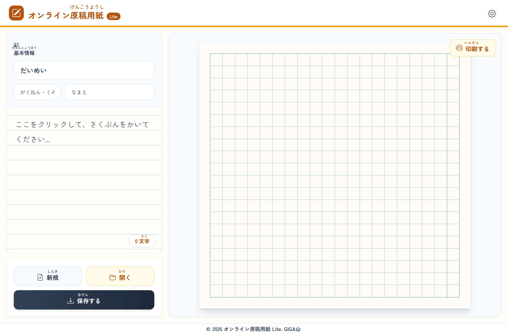

左に <ruby>打<rt>う</rt></ruby>つと、右の <ruby>原稿用紙<rt>げんこうようし</rt></ruby>に すぐ 出ます。

### つかう人と、<ruby>用意<rt>ようい</rt></ruby>する もの

つかうのは、<ruby>作文<rt>さくぶん</rt></ruby>を <ruby>書<rt>か</rt></ruby>く 人 じしんです。1年生から 6年生まで、だれでも つかえます。先生は、<ruby>印刷<rt>いんさつ</rt></ruby>と アプリの 入れ<ruby>方<rt>かた</rt></ruby>の ところを 見てください。

はじめる まえに、つぎの ものを <ruby>用意<rt>ようい</rt></ruby>してください。

1. インターネットに つながる <ruby>端末<rt>たんまつ</rt></ruby>。Chromebook・Windows・iPad・iPhone の どれでも つかえます。
2. ブラウザ。Chrome・Edge・Safari の、だいたい 2022年より あとの ものを つかってください。
3. アプリの アドレス。学校で <ruby>配<rt>くば</rt></ruby>られた リンクを つかってください。
4. アカウントは いりません。ログインの <ruby>画面<rt>がめん</rt></ruby>は <ruby>一度<rt>いちど</rt></ruby>も 出ません。

【！】<ruby>覚<rt>おぼ</rt></ruby>えて おいて ほしい こと:

- <ruby>書<rt>か</rt></ruby>いた ものは この <ruby>端末<rt>たんまつ</rt></ruby>の 中だけに のこります。ほかの <ruby>端末<rt>たんまつ</rt></ruby>には うつりません。
- <ruby>印刷<rt>いんさつ</rt></ruby>を する ときだけ、プリンターが いります。
- <ruby>一度<rt>いちど</rt></ruby> ひらいて おけば、つぎからは インターネットが なくても つかえます。

### この アプリで できない こと

さきに <ruby>書<rt>か</rt></ruby>いておきます。つぎの ことは できません。

- Google ドライブなどへ そのまま <ruby>保存<rt>ほぞん</rt></ruby>する こと。ファイルは <ruby>端末<rt>たんまつ</rt></ruby>に <ruby>書<rt>か</rt></ruby>き出します。
- ほかの <ruby>端末<rt>たんまつ</rt></ruby>と <ruby>同<rt>おな</rt></ruby>じ <ruby>中身<rt>なかみ</rt></ruby>に する こと。<ruby>書<rt>か</rt></ruby>いた ものは その <ruby>端末<rt>たんまつ</rt></ruby>にしか のこりません。
- <ruby>作文<rt>さくぶん</rt></ruby>を 2つ <ruby>以上<rt>いじょう</rt></ruby> しまって おく こと。のこるのは「いま <ruby>書<rt>か</rt></ruby>いて いる もの」1つだけです。
- <ruby>太字<rt>ふとじ</rt></ruby>や <ruby>色<rt>いろ</rt></ruby>や ふりがなを 本文に つける こと。<ruby>写真<rt>しゃしん</rt></ruby>や <ruby>表<rt>ひょう</rt></ruby>も 入れられません。

<ruby>作文<rt>さくぶん</rt></ruby>を 2つ <ruby>以上<rt>いじょう</rt></ruby> のこしたい ときは、あとに 出てくる「<ruby>保存<rt>ほぞん</rt></ruby>する」で ファイルに <ruby>書<rt>か</rt></ruby>き出して ください。

## はじめて ひらいた ときに する こと（さいしょの 1<ruby>回<rt>かい</rt></ruby>だけ）

ここは、その <ruby>端末<rt>たんまつ</rt></ruby>で いちばん はじめに <ruby>一度<rt>いちど</rt></ruby>だけ する ことです。<ruby>二回目<rt>にかいめ</rt></ruby>からは しなくて かまいません。

### ブラウザで アドレスを ひらく

1. 学校で <ruby>配<rt>くば</rt></ruby>られた リンクを おします。
2. 「よみこみちゅう…」と 出て、すぐに <ruby>原稿用紙<rt>げんこうようし</rt></ruby>の <ruby>画面<rt>がめん</rt></ruby>に <ruby>変<rt>か</rt></ruby>わります。
3. これで つかえます。ログインも、アカウントを つくる ことも いりません。

【！】<ruby>覚<rt>おぼ</rt></ruby>えて おいて ほしい こと:

- 見なれない <ruby>警告<rt>けいこく</rt></ruby>の <ruby>画面<rt>がめん</rt></ruby>は 出ません。もし 出た ときは、学校の ネットワークが この ページを <ruby>止<rt>と</rt></ruby>めて いる ことが あります。<ruby>情報<rt>じょうほう</rt></ruby>の 先生に <ruby>聞<rt>き</rt></ruby>いて ください。
- リンクを お気に入りに 入れて おくと、つぎから すぐ ひらけます。

### 【<ruby>重要<rt>じゅうよう</rt></ruby>】Chromebook や パソコンに アプリとして 入れる

入れて おくと、アイコンから ひらける ように なり、インターネットに つながって いなくても つかえます。学校の <ruby>電波<rt>でんぱ</rt></ruby>が よわい ところでも <ruby>止<rt>と</rt></ruby>まりません。

Chrome や Edge では、<ruby>画面<rt>がめん</rt></ruby>の 右上に「インストール」の ボタンが 出ます。これを おして、出てきた <ruby>画面<rt>がめん</rt></ruby>で もう<ruby>一度<rt>いちど</rt></ruby> おすと 入ります。

右上の「インストール」を おします。

「インストール」の ボタンは、ブラウザが「入れられる」と <ruby>決<rt>き</rt></ruby>めた ときだけ 出ます。もう 入れて ある <ruby>端末<rt>たんまつ</rt></ruby>や、ファイルを その まま ひらいた ときには 出ません。ボタンが 出て いない ときは、アドレスバーの 右がわに ある <ruby>丸<rt>まる</rt></ruby>い しるしを おしても 入れられます。

### iPad や iPhone の ホーム<ruby>画面<rt>がめん</rt></ruby>に 入れる

iPad と iPhone の Safari には「インストール」の ボタンが 出ません。つぎの 手じゅんで 入れます。

1. <ruby>画面<rt>がめん</rt></ruby>の 下、または 右上に ある <ruby>四角<rt>しかく</rt></ruby>から 上むきの <ruby>矢<rt>や</rt></ruby>じるしが 出た しるしを おします。
2. ならんだ ものを 下に たどって「ホーム<ruby>画面<rt>がめん</rt></ruby>に <ruby>追加<rt>ついか</rt></ruby>」を おします。
3. 右上の「<ruby>追加<rt>ついか</rt></ruby>」を おします。

これで ホーム<ruby>画面<rt>がめん</rt></ruby>に アイコンが できます。

【！】<ruby>覚<rt>おぼ</rt></ruby>えて おいて ほしい こと:

- iPad の Safari は、<ruby>一週間<rt>いっしゅうかん</rt></ruby> まったく ひらかないと、<ruby>端末<rt>たんまつ</rt></ruby>の 中に しまって ある <ruby>作文<rt>さくぶん</rt></ruby>を <ruby>消<rt>け</rt></ruby>して しまう ことが あります。
- ホーム<ruby>画面<rt>がめん</rt></ruby>に 入れて おくと、これが <ruby>起<rt>お</rt></ruby>こり にくく なります。
- <ruby>大事<rt>だいじ</rt></ruby>な <ruby>作文<rt>さくぶん</rt></ruby>は、その日の うちに「<ruby>保存<rt>ほぞん</rt></ruby>する」で ファイルに <ruby>書<rt>か</rt></ruby>き出して ください。

## <ruby>画面<rt>がめん</rt></ruby>の みかた（どこに <ruby>何<rt>なに</rt></ruby>が あるか）

ここでは、<ruby>画面<rt>がめん</rt></ruby>の どこに <ruby>何<rt>なに</rt></ruby>が あるかを 見ます。ボタンの はたらきは、あとの <ruby>章<rt>しょう</rt></ruby>で 一つずつ せつめいします。

### いちばん 上の バーに ある もの

いちばん 上の 白い バーには、アプリの <ruby>名前<rt>なまえ</rt></ruby>と、右がわに 2つの ボタンが あります。

- インストール。この <ruby>端末<rt>たんまつ</rt></ruby>に アプリとして 入れる ボタンです。もう 入れて ある ときは 出ません。
- <ruby>歯車<rt>はぐるま</rt></ruby>の しるし。<ruby>用紙<rt>ようし</rt></ruby>の かたちと <ruby>行<rt>ぎょう</rt></ruby>の おわりの きまりを かえる ボタンです。

<ruby>歯車<rt>はぐるま</rt></ruby>は いちばん 右に あります。

### 左がわ（さくぶんを <ruby>打<rt>う</rt></ruby>つ ところ）

左がわは、上と 下の 2つに <ruby>分<rt>わ</rt></ruby>かれて います。

- 上の <ruby>灰色<rt>はいいろ</rt></ruby>の ところ。「だいめい」「がくねん・くみ」「なまえ」の 3つの わくが あります。
- 下の うすい <ruby>黄色<rt>きいろ</rt></ruby>の ところ。<ruby>作文<rt>さくぶん</rt></ruby>の 本文を <ruby>打<rt>う</rt></ruby>つ わくです。右下に <ruby>文字数<rt>もじすう</rt></ruby>が 出ます。
- いちばん 下。「<ruby>新規<rt>しんき</rt></ruby>」「<ruby>開<rt>ひら</rt></ruby>く」「<ruby>保存<rt>ほぞん</rt></ruby>する」の 3つの ボタンが ならびます。

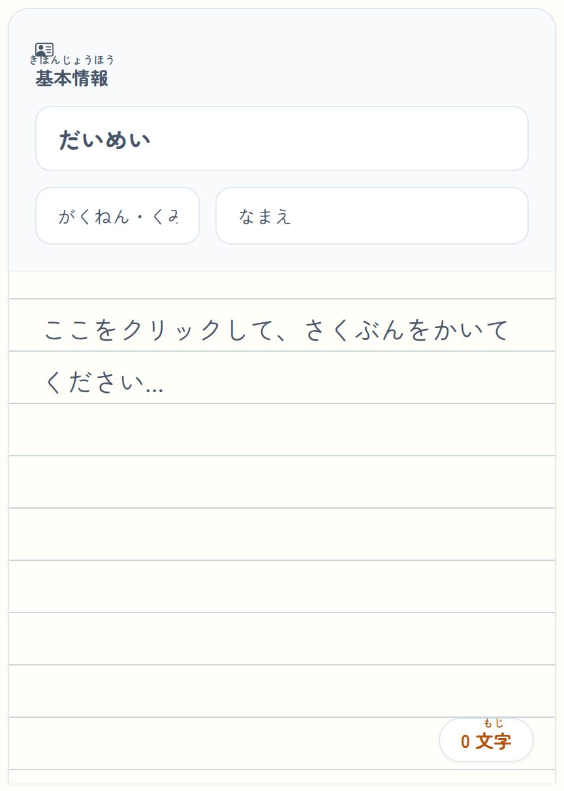

本文は 下の <ruby>広<rt>ひろ</rt></ruby>い わくに <ruby>打<rt>う</rt></ruby>ちます。

### 右がわ（<ruby>原稿用紙<rt>げんこうようし</rt></ruby>が 出る ところ）

右がわは、<ruby>原稿用紙<rt>げんこうようし</rt></ruby>が 出る ところです。<ruby>打<rt>う</rt></ruby>った <ruby>文章<rt>ぶんしょう</rt></ruby>が たてがきで すぐに ならびます。

<ruby>原稿用紙<rt>げんこうようし</rt></ruby>の 大きさは、<ruby>画面<rt>がめん</rt></ruby>の <ruby>高<rt>たか</rt></ruby>さに <ruby>合<rt>あ</rt></ruby>わせて ひとりでに かわります。<ruby>画面<rt>がめん</rt></ruby>を 大きくすると、マスも 大きく なります。

右上には「<ruby>印刷<rt>いんさつ</rt></ruby>する」の ボタンが あります。

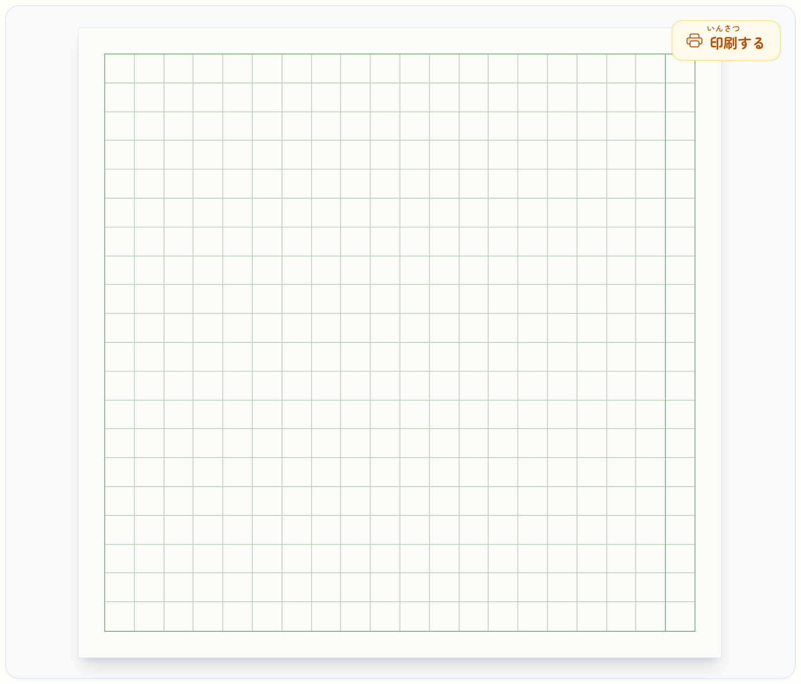

「<ruby>印刷<rt>いんさつ</rt></ruby>する」は <ruby>原稿用紙<rt>げんこうようし</rt></ruby>の 右上に あります。

### せまい <ruby>画面<rt>がめん</rt></ruby>の「かく」「<ruby>原稿用紙<rt>げんこうようし</rt></ruby>をみる」タブ

スマートフォンや、たてに した タブレットのように <ruby>画面<rt>がめん</rt></ruby>が せまい ときは、左と 右が ならびません。かわりに、上に「かく」と「<ruby>原稿用紙<rt>げんこうようし</rt></ruby>をみる」の 2つの タブが 出ます。おして <ruby>切<rt>き</rt></ruby>りかえて つかいます。

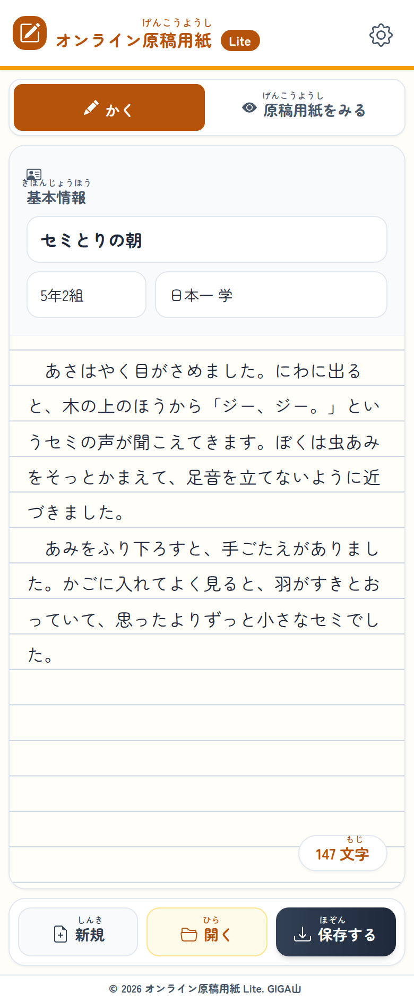

「かく」を おすと、<ruby>打<rt>う</rt></ruby>つ <ruby>画面<rt>がめん</rt></ruby>に なります。

はじめは「かく」が えらばれて います。<ruby>書<rt>か</rt></ruby>いた ものを たしかめたい ときは「<ruby>原稿用紙<rt>げんこうようし</rt></ruby>をみる」を おします。

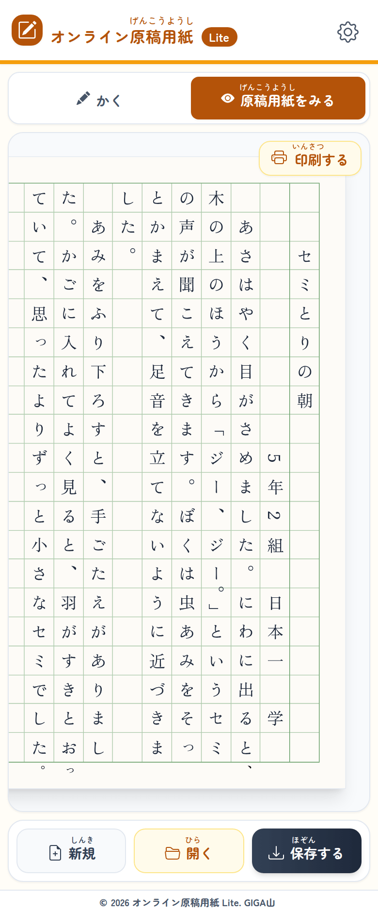

「<ruby>原稿用紙<rt>げんこうようし</rt></ruby>をみる」を おすと、<ruby>原稿用紙<rt>げんこうようし</rt></ruby>に なります。

【！】<ruby>覚<rt>おぼ</rt></ruby>えて おいて ほしい こと:

- タブは <ruby>画面<rt>がめん</rt></ruby>が せまい ときだけ 出ます。パソコンでは 左と 右が いっしょに ならぶので 出ません。
- どちらの タブに いても、<ruby>打<rt>う</rt></ruby>った ものは <ruby>消<rt>き</rt></ruby>えません。
- 「<ruby>印刷<rt>いんさつ</rt></ruby>する」の ボタンは「<ruby>原稿用紙<rt>げんこうようし</rt></ruby>をみる」の がわに あります。

## だいめい・がくねん・なまえを 入れる

<ruby>作文<rt>さくぶん</rt></ruby>を <ruby>打<rt>う</rt></ruby>ちはじめる <ruby>前<rt>まえ</rt></ruby>に、上の 3つの わくを うめます。ここに 入れた ものは、<ruby>原稿用紙<rt>げんこうようし</rt></ruby>の はじめの 2<ruby>行<rt>ぎょう</rt></ruby>に ひとりでに 入ります。

### 3つの わくに 入れる

1. いちばん 上の <ruby>広<rt>ひろ</rt></ruby>い わくに、<ruby>作文<rt>さくぶん</rt></ruby>の だいめいを <ruby>打<rt>う</rt></ruby>ちます。
2. 左下の 小さい わくに、がくねんと くみを <ruby>打<rt>う</rt></ruby>ちます。れい: 5年2<ruby>組<rt>くみ</rt></ruby>
3. 右下の わくに、なまえを <ruby>打<rt>う</rt></ruby>ちます。れい: 日本一 学

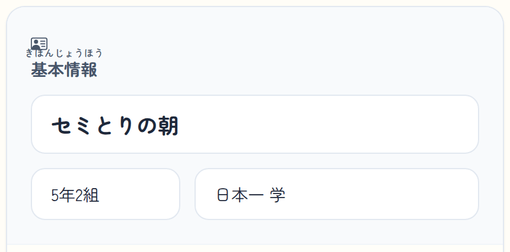

3つとも <ruby>打<rt>う</rt></ruby>つと、右の <ruby>原稿用紙<rt>げんこうようし</rt></ruby>に 出ます。

【！】<ruby>覚<rt>おぼ</rt></ruby>えて おいて ほしい こと:

- 3つとも、<ruby>後<rt>あと</rt></ruby>から <ruby>何度<rt>なんど</rt></ruby>でも <ruby>直<rt>なお</rt></ruby>せます。
- からの まま でも <ruby>作文<rt>さくぶん</rt></ruby>は <ruby>書<rt>か</rt></ruby>けます。その ときは <ruby>原稿用紙<rt>げんこうようし</rt></ruby>の はじめの <ruby>行<rt>ぎょう</rt></ruby>が あきます。
- 「<ruby>保存<rt>ほぞん</rt></ruby>する」で できる ファイルの <ruby>名前<rt>なまえ</rt></ruby>に、だいめいと なまえが つかわれます。

### 入れた ものが <ruby>原稿用紙<rt>げんこうようし</rt></ruby>の どこに 出るか

だいめいは <ruby>原稿用紙<rt>げんこうようし</rt></ruby>の 1<ruby>行目<rt>ぎょうめ</rt></ruby>に、<ruby>頭<rt>あたま</rt></ruby>から 2マス 下げて 入ります。がくねん・くみと なまえは つぎの <ruby>行<rt>ぎょう</rt></ruby>の 下の ほうに、1マス あけて 入ります。

たてがきなので、1<ruby>行目<rt>ぎょうめ</rt></ruby>は いちばん 右の <ruby>行<rt>ぎょう</rt></ruby>です。

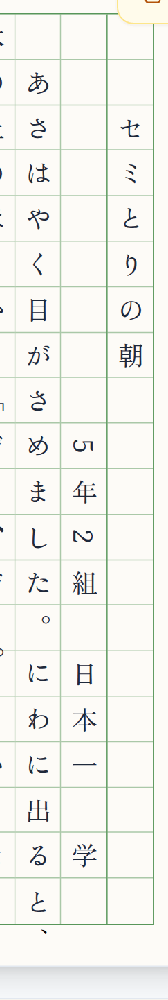

右から 1<ruby>行目<rt>ぎょうめ</rt></ruby>が だいめい、2<ruby>行目<rt>ぎょうめ</rt></ruby>が なまえです。

【！】<ruby>覚<rt>おぼ</rt></ruby>えて おいて ほしい こと:

- この 2<ruby>行<rt>ぎょう</rt></ruby>は 本文の <ruby>文字数<rt>もじすう</rt></ruby>には 入りません。
- がくねんと なまえの あいだには、ひとりでに 空きが 入ります。
- だいめいが <ruby>長<rt>なが</rt></ruby>くて 1<ruby>行<rt>ぎょう</rt></ruby>に 入らない ときは、つぎの <ruby>行<rt>ぎょう</rt></ruby>に つづきます。

## さくぶんを <ruby>打<rt>う</rt></ruby>って、<ruby>原稿用紙<rt>げんこうようし</rt></ruby>で たしかめる

ここからが、この アプリの まん中の はたらきです。<ruby>打<rt>う</rt></ruby>った ものが すぐ <ruby>原稿用紙<rt>げんこうようし</rt></ruby>に なります。

### ほんぶんの わくに <ruby>打<rt>う</rt></ruby>つ

1. 左がわの <ruby>広<rt>ひろ</rt></ruby>い わくを おします。「ここをクリックして、さくぶんをかいてください...」と <ruby>書<rt>か</rt></ruby>いて ある ところです。
2. その まま <ruby>作文<rt>さくぶん</rt></ruby>を <ruby>打<rt>う</rt></ruby>ちます。
3. <ruby>打<rt>う</rt></ruby>つと すぐ、右の <ruby>原稿用紙<rt>げんこうようし</rt></ruby>に 出ます。

<ruby>段落<rt>だんらく</rt></ruby>の はじめを 1マス 下げたい ときは、<ruby>行<rt>ぎょう</rt></ruby>の あたまで スペースを 1つ 入れて ください。

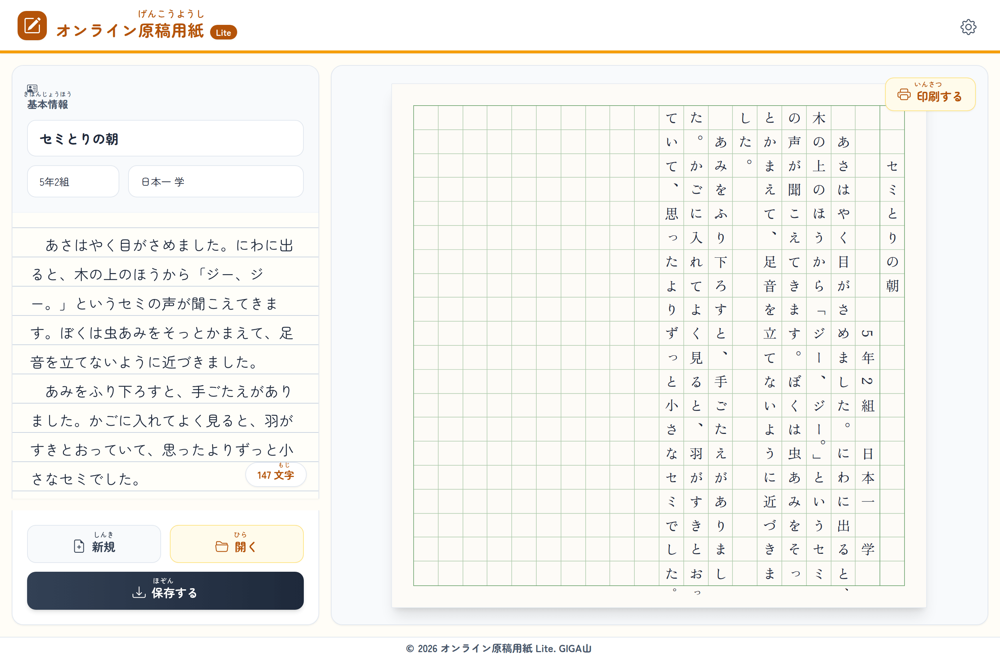

<ruby>打<rt>う</rt></ruby>った ものが そのまま 右に ならびます。

【！】<ruby>覚<rt>おぼ</rt></ruby>えて おいて ほしい こと:

- <ruby>打<rt>う</rt></ruby>った ものは ひとりでに しまわれます。じぶんで <ruby>保存<rt>ほぞん</rt></ruby>の ボタンを おす ひつようは ありません。
- 「、」や 「。」が <ruby>行<rt>ぎょう</rt></ruby>の あたまに <ruby>来<rt>こ</rt></ruby>ないよう、アプリが <ruby>自動<rt>じどう</rt></ruby>で ととのえます。
- <ruby>太字<rt>ふとじ</rt></ruby>や <ruby>色<rt>いろ</rt></ruby>は つけられません。字は すべて <ruby>同<rt>おな</rt></ruby>じ <ruby>形<rt>かたち</rt></ruby>に なります。

### 右下の <ruby>文字数<rt>もじすう</rt></ruby>を 見る

本文の わくの 右下に、いま <ruby>打<rt>う</rt></ruby>って ある <ruby>文字数<rt>もじすう</rt></ruby>が 出ます。<ruby>原稿用紙<rt>げんこうようし</rt></ruby>の 400マスと 見くらべる ために あります。

<ruby>改行<rt>かいぎょう</rt></ruby>は <ruby>数<rt>かず</rt></ruby>に 入りません。<ruby>行<rt>ぎょう</rt></ruby>を かえた <ruby>分<rt>ぶん</rt></ruby>だけ ふえる ことは ないので、「<ruby>思<rt>おも</rt></ruby>ったより <ruby>少<rt>すく</rt></ruby>ない」と <ruby>感<rt>かん</rt></ruby>じる ことが あります。

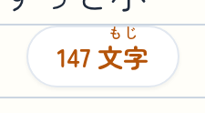

この <ruby>絵<rt>え</rt></ruby>では 147文字と 出て います。

### 左と 右を いっしょに <ruby>動<rt>うご</rt></ruby>かす

左の わくを 下に <ruby>動<rt>うご</rt></ruby>かすと、右の <ruby>原稿用紙<rt>げんこうようし</rt></ruby>も <ruby>同<rt>おな</rt></ruby>じ ところへ <ruby>動<rt>うご</rt></ruby>きます。右の <ruby>原稿用紙<rt>げんこうようし</rt></ruby>を <ruby>動<rt>うご</rt></ruby>かしても、左が ついて きます。<ruby>長<rt>なが</rt></ruby>い <ruby>作文<rt>さくぶん</rt></ruby>の とき、いま どこを <ruby>打<rt>う</rt></ruby>って いるかが すぐ <ruby>分<rt>わ</rt></ruby>かります。

<ruby>原稿用紙<rt>げんこうようし</rt></ruby>の うえでは、マウスの ホイールを 上下に <ruby>回<rt>まわ</rt></ruby>すと よこに <ruby>動<rt>うご</rt></ruby>きます。

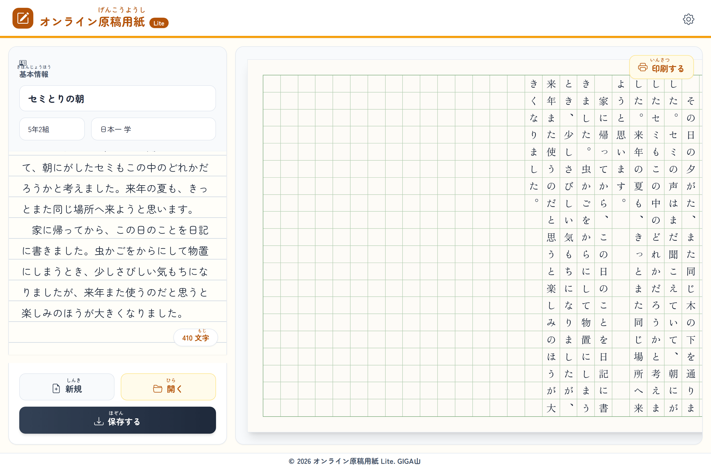

左を <ruby>動<rt>うご</rt></ruby>かすと、右も <ruby>同<rt>おな</rt></ruby>じ ところへ <ruby>動<rt>うご</rt></ruby>きます。

## <ruby>用紙<rt>ようし</rt></ruby>の かたちを えらぶ（20文字×20<ruby>行<rt>ぎょう</rt></ruby>と 15文字×16<ruby>行<rt>ぎょう</rt></ruby>）

<ruby>原稿用紙<rt>げんこうようし</rt></ruby>の マスの <ruby>数<rt>かず</rt></ruby>は 2つから えらべます。学年や、<ruby>書<rt>か</rt></ruby>く ものに <ruby>合<rt>あ</rt></ruby>わせて かえて ください。

### <ruby>設定<rt>せってい</rt></ruby>の <ruby>画面<rt>がめん</rt></ruby>を ひらく

1. いちばん 上の バーの 右がわに ある <ruby>歯車<rt>はぐるま</rt></ruby>の しるしを おします。
2. 「<ruby>設定<rt>せってい</rt></ruby>」の <ruby>画面<rt>がめん</rt></ruby>が まん中に 出ます。
3. かえ おわったら、右下の「<ruby>保存<rt>ほぞん</rt></ruby>して<ruby>閉<rt>と</rt></ruby>じる」を おします。

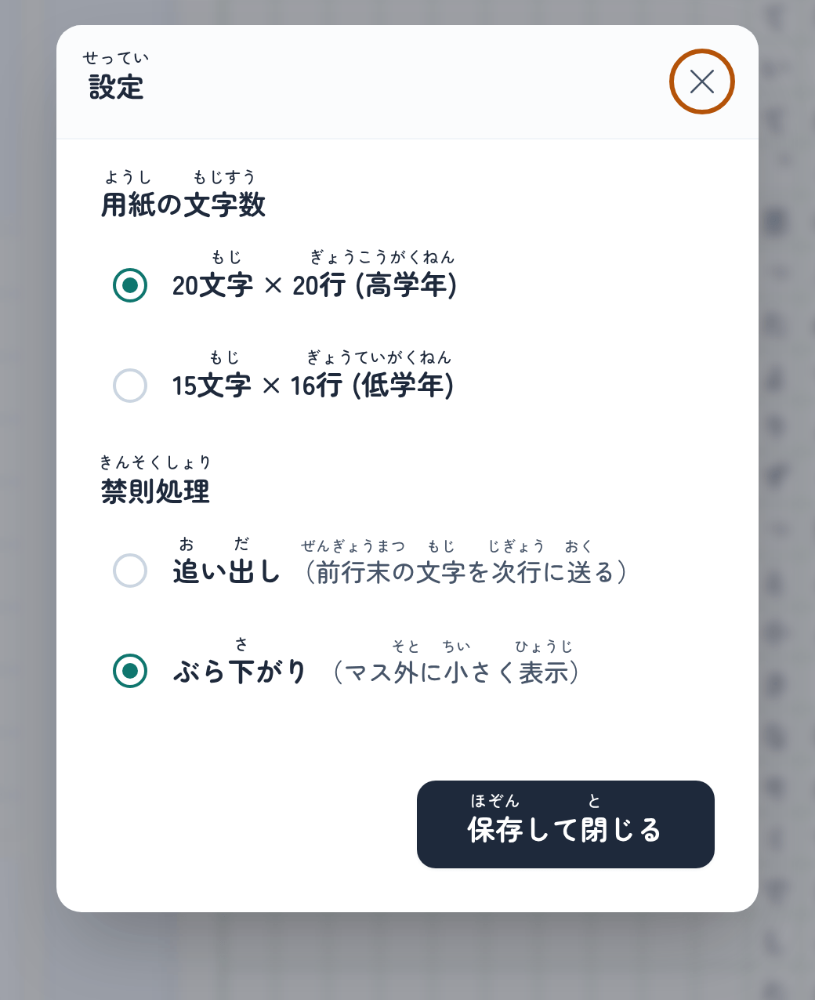

<ruby>歯車<rt>はぐるま</rt></ruby>を おすと この <ruby>画面<rt>がめん</rt></ruby>が 出ます。

【！】<ruby>覚<rt>おぼ</rt></ruby>えて おいて ほしい こと:

- えらんだ ものは <ruby>作文<rt>さくぶん</rt></ruby>と いっしょに しまわれます。つぎに ひらいた ときも <ruby>同<rt>おな</rt></ruby>じ ままです。
- 右上の ばつじるしを おしても <ruby>閉<rt>と</rt></ruby>じられます。えらんだ ものは どちらでも のこります。
- キーボードの Esc キーでも <ruby>閉<rt>と</rt></ruby>じられます。

### <ruby>高学年<rt>こうがくねん</rt></ruby>の <ruby>用紙<rt>ようし</rt></ruby>と <ruby>低学年<rt>ていがくねん</rt></ruby>の <ruby>用紙<rt>ようし</rt></ruby>

えらべるのは つぎの 2つです。はじめは「20文字 × 20<ruby>行<rt>ぎょう</rt></ruby>」に なって います。

- 20文字 × 20<ruby>行<rt>ぎょう</rt></ruby>（<ruby>高学年<rt>こうがくねん</rt></ruby>）。1まいが 400マスに なります。ふつうの <ruby>原稿用紙<rt>げんこうようし</rt></ruby>と <ruby>同<rt>おな</rt></ruby>じ <ruby>数<rt>かず</rt></ruby>です。
- 15文字 × 16<ruby>行<rt>ぎょう</rt></ruby>（<ruby>低学年<rt>ていがくねん</rt></ruby>）。1まいが 240マスに なります。マスが 大きく なるので、字が 大きい 人でも <ruby>書<rt>か</rt></ruby>きやすく なります。

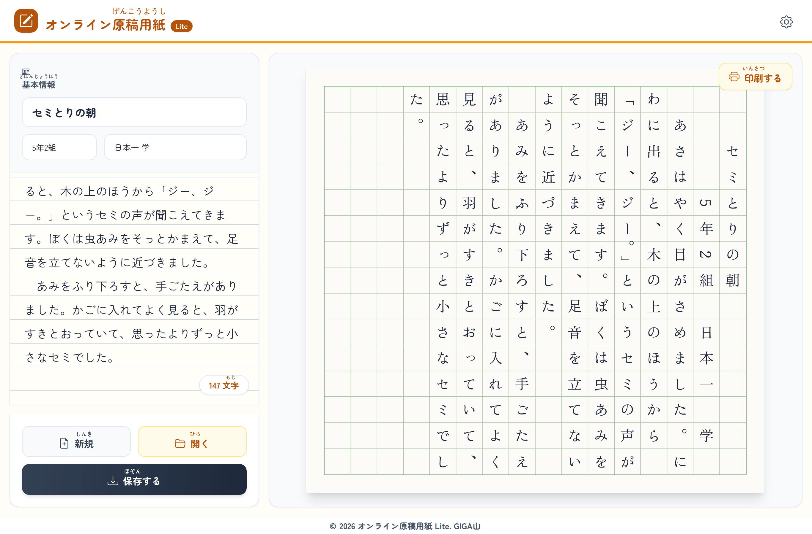

マスが <ruby>少<rt>すく</rt></ruby>なく、その ぶん 大きく なります。

【！】<ruby>覚<rt>おぼ</rt></ruby>えて おいて ほしい こと:

- かえても <ruby>打<rt>う</rt></ruby>った <ruby>作文<rt>さくぶん</rt></ruby>は <ruby>消<rt>き</rt></ruby>えません。ならびかたが かわるだけです。
- <ruby>印刷<rt>いんさつ</rt></ruby>した ときの マスの <ruby>数<rt>かず</rt></ruby>も、ここで えらんだ ものに なります。
- 15文字 × 16<ruby>行<rt>ぎょう</rt></ruby>の ほうが、1まいに 入る 字は <ruby>少<rt>すく</rt></ruby>なく なります。

## <ruby>行<rt>ぎょう</rt></ruby>の おわりの きまり（<ruby>禁則処理<rt>きんそくしょり</rt></ruby>）を えらぶ

「、」や 「。」が <ruby>行<rt>ぎょう</rt></ruby>の いちばん あたまに <ruby>来<rt>く</rt></ruby>ると <ruby>読<rt>よ</rt></ruby>みにくく なります。それを どう ととのえるかを えらべます。えらび<ruby>方<rt>かた</rt></ruby>は 2つで、どちらも <ruby>国語<rt>こくご</rt></ruby>の <ruby>教科書<rt>きょうかしょ</rt></ruby>で つかわれて いる <ruby>書<rt>か</rt></ruby>き<ruby>方<rt>かた</rt></ruby>です。

### 「ぶら下がり」と「<ruby>追<rt>お</rt></ruby>い出し」の ちがい

<ruby>設定<rt>せってい</rt></ruby>の <ruby>画面<rt>がめん</rt></ruby>の 下の ほうに「<ruby>禁則処理<rt>きんそくしょり</rt></ruby>」が あります。

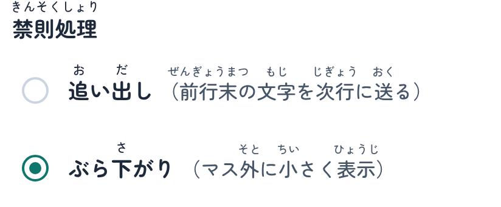

2つから 1つを えらびます。

はじめは「ぶら下がり」に なって います。「ぶら下がり」は、<ruby>行<rt>ぎょう</rt></ruby>の おわりに あふれた 「、」や 「。」を、マスの <ruby>外<rt>そと</rt></ruby>に 小さく 出します。

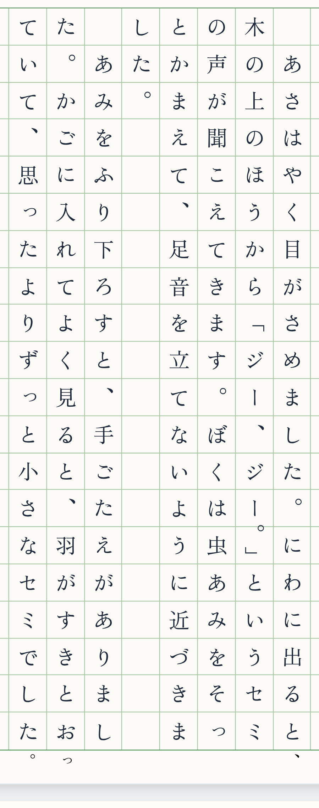

<ruby>行<rt>ぎょう</rt></ruby>の 下に 「、」が 小さく 出て います。

「<ruby>追<rt>お</rt></ruby>い出し」は、<ruby>行<rt>ぎょう</rt></ruby>の おわりの 字を つぎの <ruby>行<rt>ぎょう</rt></ruby>の あたまへ <ruby>送<rt>おく</rt></ruby>って、「、」や 「。」が あたまに <ruby>来<rt>こ</rt></ruby>ないように します。マスの <ruby>外<rt>そと</rt></ruby>には <ruby>何<rt>なに</rt></ruby>も 出ません。

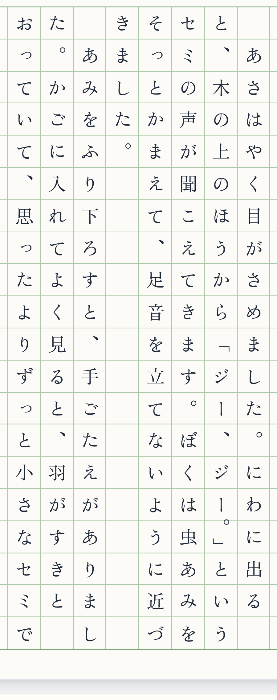

<ruby>同<rt>おな</rt></ruby>じ <ruby>文章<rt>ぶんしょう</rt></ruby>でも、<ruby>行<rt>ぎょう</rt></ruby>の <ruby>切<rt>き</rt></ruby>れ目が かわります。

【！】<ruby>覚<rt>おぼ</rt></ruby>えて おいて ほしい こと:

- どちらを えらんでも、<ruby>打<rt>う</rt></ruby>った <ruby>文章<rt>ぶんしょう</rt></ruby> じたいは 1文字も かわりません。
- えらんだ ものは <ruby>印刷<rt>いんさつ</rt></ruby>にも そのまま 出ます。
- 「ぶら下がり」で マスの <ruby>外<rt>そと</rt></ruby>に 出せるのは 2マス<ruby>分<rt>ぶん</rt></ruby>までです。それを こえた <ruby>分<rt>ぶん</rt></ruby>は つぎの <ruby>行<rt>ぎょう</rt></ruby>の あたまに おかれます。

### えらばなくても いつも <ruby>自動<rt>じどう</rt></ruby>で する こと

つぎの 2つは、上で どちらを えらんでも いつも アプリが します。じぶんで <ruby>切<rt>き</rt></ruby>る ことは できません。

- 「「」や 「（」のような ひらく かっこが、<ruby>行<rt>ぎょう</rt></ruby>の いちばん おわりの マスに <ruby>来<rt>こ</rt></ruby>ないように します。先に つぎの <ruby>行<rt>ぎょう</rt></ruby>へ <ruby>送<rt>おく</rt></ruby>ります。
- 「。」」 「、」」 「！」」 「？」」のような <ruby>組<rt>く</rt></ruby>み<ruby>合<rt>あ</rt></ruby>わせは、1つの マスに まとめて 入れます。

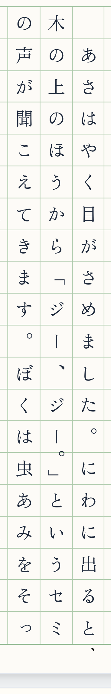

かっこと 「。」が <ruby>同<rt>おな</rt></ruby>じ マスに 入って います。

## <ruby>書<rt>か</rt></ruby>いた ものが ひとりでに のこる（<ruby>自動保存<rt>じどうほぞん</rt></ruby>と「<ruby>新規<rt>しんき</rt></ruby>」）

<ruby>打<rt>う</rt></ruby>った ものは じぶんで <ruby>保存<rt>ほぞん</rt></ruby>しなくても のこります。ただし、のこるのは 1つだけです。ここを <ruby>知<rt>し</rt></ruby>らないと、<ruby>前<rt>まえ</rt></ruby>の <ruby>作文<rt>さくぶん</rt></ruby>を なくして しまいます。

### <ruby>打<rt>う</rt></ruby>つと 1びょうで しまわれる

<ruby>打<rt>う</rt></ruby>つのを やめてから 1びょうほどで、<ruby>書<rt>か</rt></ruby>いた ものが <ruby>端末<rt>たんまつ</rt></ruby>の 中に しまわれます。しまわれた ことを <ruby>知<rt>し</rt></ruby>らせる <ruby>表示<rt>ひょうじ</rt></ruby>は 出ません。

うっかり <ruby>画面<rt>がめん</rt></ruby>を <ruby>閉<rt>と</rt></ruby>じても、つぎに ひらいた ときに つづきから <ruby>始<rt>はじ</rt></ruby>められます。タブを <ruby>閉<rt>と</rt></ruby>じる ときにも、もう<ruby>一度<rt>いちど</rt></ruby> しまいなおして います。

【！】<ruby>覚<rt>おぼ</rt></ruby>えて おいて ほしい こと:

- しまわれるのは、その <ruby>端末<rt>たんまつ</rt></ruby>の その ブラウザの 中だけです。ほかの <ruby>端末<rt>たんまつ</rt></ruby>では 出て きません。
- ひみつの <ruby>画面<rt>がめん</rt></ruby>（シークレットウィンドウ）で ひらくと、<ruby>閉<rt>と</rt></ruby>じた ときに <ruby>消<rt>き</rt></ruby>えます。
- <ruby>用紙<rt>ようし</rt></ruby>の かたちと <ruby>禁則処理<rt>きんそくしょり</rt></ruby>の えらび<ruby>方<rt>かた</rt></ruby>も、<ruby>作文<rt>さくぶん</rt></ruby>と いっしょに しまわれます。

### 「<ruby>前回<rt>ぜんかい</rt></ruby>の<ruby>続<rt>つづ</rt></ruby>きから<ruby>始<rt>はじ</rt></ruby>めます」と 出た とき

<ruby>前<rt>まえ</rt></ruby>に <ruby>書<rt>か</rt></ruby>いた ものが のこって いる ときは、ひらいた すぐ あとに <ruby>画面<rt>がめん</rt></ruby>の 右上に「<ruby>前回<rt>ぜんかい</rt></ruby>の<ruby>続<rt>つづ</rt></ruby>きから<ruby>始<rt>はじ</rt></ruby>めます」と 出ます。その まま つづきを <ruby>打<rt>う</rt></ruby>って かまいません。

この <ruby>知<rt>し</rt></ruby>らせは 3びょうほどで ひとりでに <ruby>消<rt>き</rt></ruby>えます。おす ひつようは ありません。

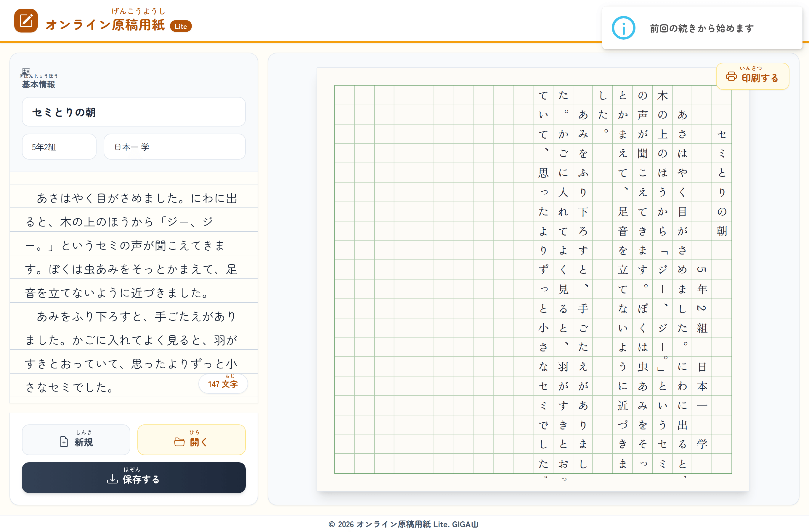

<ruby>前<rt>まえ</rt></ruby>の つづきが そのまま 出て います。

### 【！！】「<ruby>新規<rt>しんき</rt></ruby>」で ぜんぶ <ruby>消<rt>け</rt></ruby>して <ruby>書<rt>か</rt></ruby>きなおす

「<ruby>新規<rt>しんき</rt></ruby>」を おすと、いま <ruby>書<rt>か</rt></ruby>いて いる ものを <ruby>消<rt>け</rt></ruby>して、まっさらな <ruby>状態<rt>じょうたい</rt></ruby>に します。<ruby>消<rt>け</rt></ruby>した ものは もどせません。

1. 左下の「<ruby>新規<rt>しんき</rt></ruby>」を おします。
2. 「<ruby>今<rt>いま</rt></ruby><ruby>書<rt>か</rt></ruby>いている<ruby>内容<rt>ないよう</rt></ruby>は<ruby>消<rt>き</rt></ruby>えます。よろしいですか？」と きかれます。
3. <ruby>消<rt>け</rt></ruby>して よければ「はい、<ruby>消<rt>け</rt></ruby>して<ruby>新<rt>あたら</rt></ruby>しく<ruby>書<rt>か</rt></ruby>く」を おします。やめる ときは「いいえ」を おします。

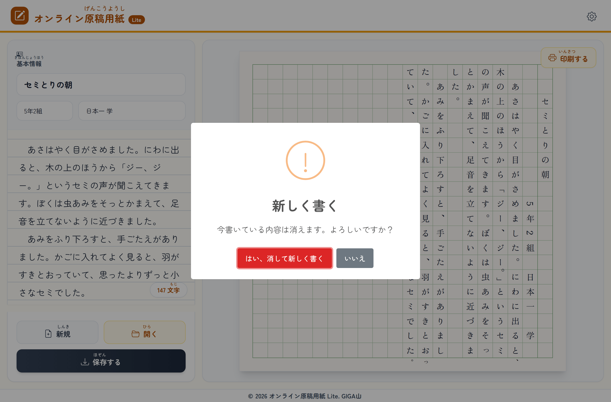

赤い ボタンを おすと <ruby>消<rt>き</rt></ruby>えます。

おすと、だいめいも なまえも 本文も からに なり、「<ruby>新<rt>あたら</rt></ruby>しく<ruby>始<rt>はじ</rt></ruby>めました」と 右上に 出ます。

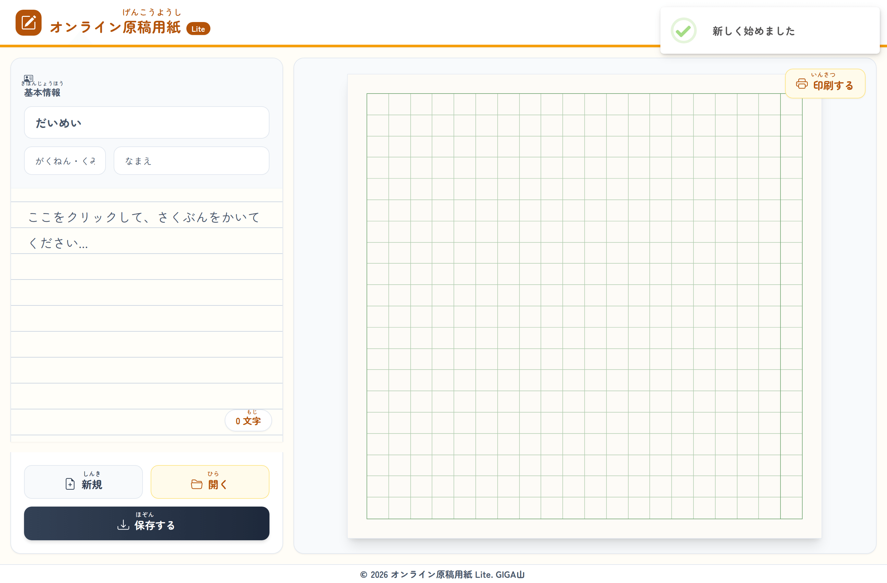

3つの わくも 本文も からに なります。

【！！】いちばん <ruby>大事<rt>だいじ</rt></ruby>な <ruby>注意<rt>ちゅうい</rt></ruby>:

- <ruby>消<rt>け</rt></ruby>した <ruby>作文<rt>さくぶん</rt></ruby>は もどせません。とっておきたい ものは、先に「<ruby>保存<rt>ほぞん</rt></ruby>する」で ファイルに <ruby>書<rt>か</rt></ruby>き出して ください。
- <ruby>用紙<rt>ようし</rt></ruby>の かたちと <ruby>禁則処理<rt>きんそくしょり</rt></ruby>の えらび<ruby>方<rt>かた</rt></ruby>は <ruby>消<rt>き</rt></ruby>えません。そのまま のこります。
- みんなで つかう <ruby>端末<rt>たんまつ</rt></ruby>では、じゅぎょうの おわりに「<ruby>新規<rt>しんき</rt></ruby>」を おして <ruby>消<rt>け</rt></ruby>してから <ruby>返<rt>かえ</rt></ruby>して ください。

## ファイルに <ruby>保存<rt>ほぞん</rt></ruby>する・ファイルを <ruby>開<rt>ひら</rt></ruby>く

<ruby>作文<rt>さくぶん</rt></ruby>を あとに のこしたい ときや、先生に 出したい ときは、ファイルに <ruby>書<rt>か</rt></ruby>き出します。<ruby>書<rt>か</rt></ruby>き出した ファイルは、この アプリで また ひらけます。

### 下に ならんだ 3つの ボタン

左がわの いちばん 下に、3つの ボタンが ならんで います。

- <ruby>新規<rt>しんき</rt></ruby>。いま <ruby>書<rt>か</rt></ruby>いて いる ものを <ruby>消<rt>け</rt></ruby>して、まっさらに します。
- <ruby>開<rt>ひら</rt></ruby>く。<ruby>書<rt>か</rt></ruby>き出した ファイルを <ruby>読<rt>よ</rt></ruby>みこみます。
- <ruby>保存<rt>ほぞん</rt></ruby>する。いま <ruby>書<rt>か</rt></ruby>いて いる ものを ファイルに <ruby>書<rt>か</rt></ruby>き出します。

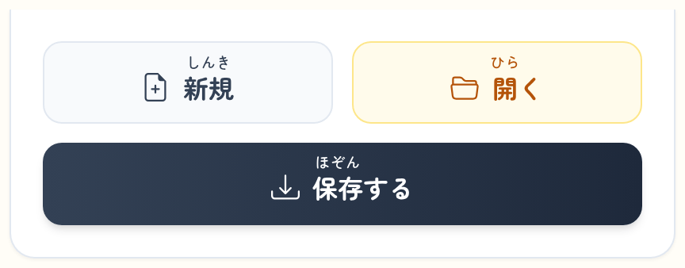

3つとも 左がわの いちばん 下に あります。

### 「<ruby>保存<rt>ほぞん</rt></ruby>する」で ファイルに <ruby>書<rt>か</rt></ruby>き出す

1. 「<ruby>保存<rt>ほぞん</rt></ruby>する」を おします。
2. ファイルが <ruby>端末<rt>たんまつ</rt></ruby>に <ruby>書<rt>か</rt></ruby>き出されます。ふつうは「ダウンロード」の ところに 入ります。
3. <ruby>書<rt>か</rt></ruby>き出した ファイルは、先生に 出したり、ほかの ところへ うつしたり できます。

だいめいも 本文も からの ときは、<ruby>書<rt>か</rt></ruby>き出せません。「まだ<ruby>何<rt>なに</rt></ruby>も<ruby>書<rt>か</rt></ruby>いていません」と 出ます。

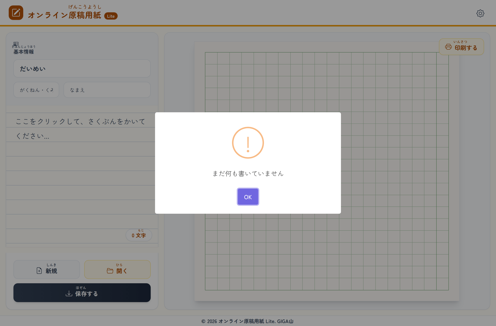

<ruby>何<rt>なに</rt></ruby>か <ruby>書<rt>か</rt></ruby>いてから もう<ruby>一度<rt>いちど</rt></ruby> おします。

【！】<ruby>覚<rt>おぼ</rt></ruby>えて おいて ほしい こと:

- <ruby>書<rt>か</rt></ruby>き出しても、<ruby>画面<rt>がめん</rt></ruby>の <ruby>作文<rt>さくぶん</rt></ruby>は <ruby>消<rt>き</rt></ruby>えません。そのまま つづけて <ruby>書<rt>か</rt></ruby>けます。
- <ruby>同<rt>おな</rt></ruby>じ <ruby>作文<rt>さくぶん</rt></ruby>を <ruby>何度<rt>なんど</rt></ruby> <ruby>書<rt>か</rt></ruby>き出しても かまいません。
- <ruby>書<rt>か</rt></ruby>き出した ファイルは、ほかの <ruby>端末<rt>たんまつ</rt></ruby>に うつして、そこで <ruby>読<rt>よ</rt></ruby>みこむ ことも できます。

### できる ファイルの <ruby>名前<rt>なまえ</rt></ruby>と <ruby>中身<rt>なかみ</rt></ruby>

ファイルの <ruby>名前<rt>なまえ</rt></ruby>は「だいめい_なまえ.txt」に なります。れいの <ruby>画面<rt>がめん</rt></ruby>では「セミとりの<ruby>朝<rt>あさ</rt></ruby>_日本一 学.txt」に なりました。

だいめいも なまえも からの ときは、「<ruby>作文<rt>さくぶん</rt></ruby>_2026-09-01.txt」のように その日の 日づけの <ruby>名前<rt>なまえ</rt></ruby>に なります。

<ruby>中身<rt>なかみ</rt></ruby>は ふつうの 文字だけの ファイルです。上に だいめいと がくねんと なまえが 3<ruby>行<rt>ぎょう</rt></ruby> ならび、<ruby>線<rt>せん</rt></ruby>を はさんで その下に 本文が 入ります。

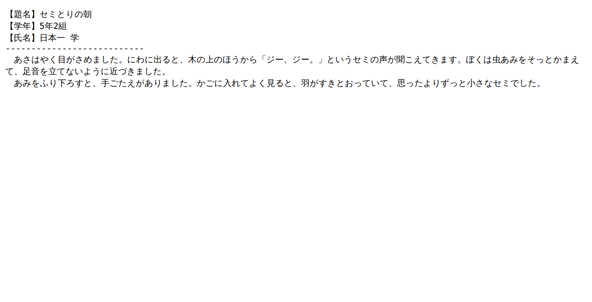

上の 3<ruby>行<rt>ぎょう</rt></ruby>の あとに 本文が つづきます。

### 「<ruby>開<rt>ひら</rt></ruby>く」で ファイルを <ruby>読<rt>よ</rt></ruby>みこむ

1. 「<ruby>開<rt>ひら</rt></ruby>く」を おします。
2. <ruby>端末<rt>たんまつ</rt></ruby>の ファイルを えらぶ <ruby>画面<rt>がめん</rt></ruby>が 出ます。
3. <ruby>読<rt>よ</rt></ruby>みこみたい ファイルを えらびます。えらべるのは 「.txt」の ファイルだけです。
4. <ruby>読<rt>よ</rt></ruby>みこむと「<ruby>読<rt>よ</rt></ruby>み<ruby>込<rt>こ</rt></ruby>みました」と 右上に 出ます。

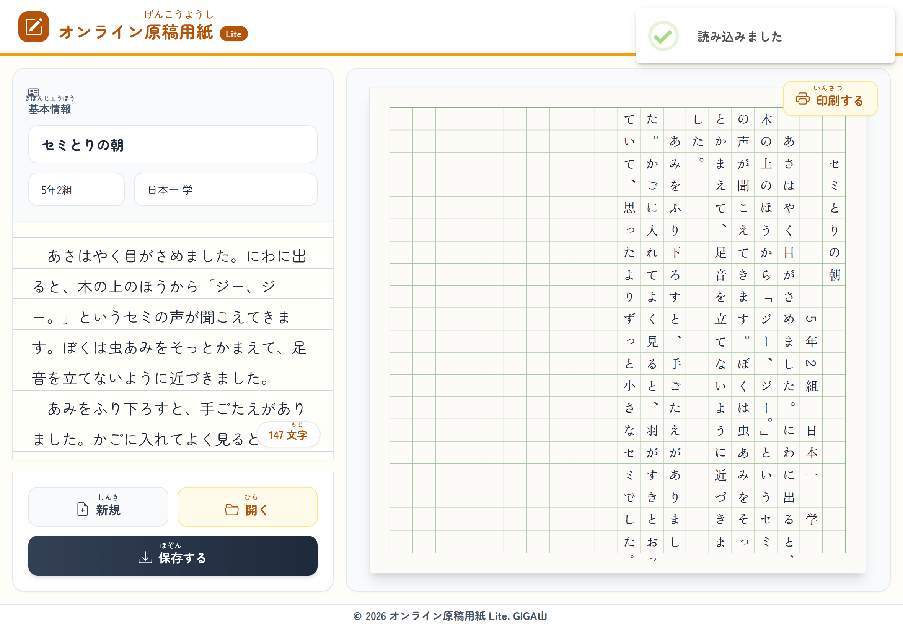

だいめいも なまえも 本文も もどって います。

【！】<ruby>覚<rt>おぼ</rt></ruby>えて おいて ほしい こと:

- <ruby>読<rt>よ</rt></ruby>みこむと、いま <ruby>書<rt>か</rt></ruby>いて いる ものは 上<ruby>書<rt>か</rt></ruby>きされます。先に「<ruby>保存<rt>ほぞん</rt></ruby>する」で のこして ください。
- Word の <ruby>文書<rt>ぶんしょ</rt></ruby>や PDF は <ruby>読<rt>よ</rt></ruby>みこめません。
- 上の 3<ruby>行<rt>ぎょう</rt></ruby>が ある ファイルなら、だいめい・がくねん・なまえ・本文に きちんと <ruby>分<rt>わ</rt></ruby>けて 入ります。

### だいめいの ない ファイルを <ruby>読<rt>よ</rt></ruby>みこむ とき

メモ<ruby>帳<rt>ちょう</rt></ruby>などで <ruby>書<rt>か</rt></ruby>いた ふつうの <ruby>文章<rt>ぶんしょう</rt></ruby>の ファイルにも、上の 3<ruby>行<rt>ぎょう</rt></ruby>が ありません。その ときは <ruby>読<rt>よ</rt></ruby>みこむ <ruby>前<rt>まえ</rt></ruby>に たしかめの <ruby>画面<rt>がめん</rt></ruby>が 出ます。

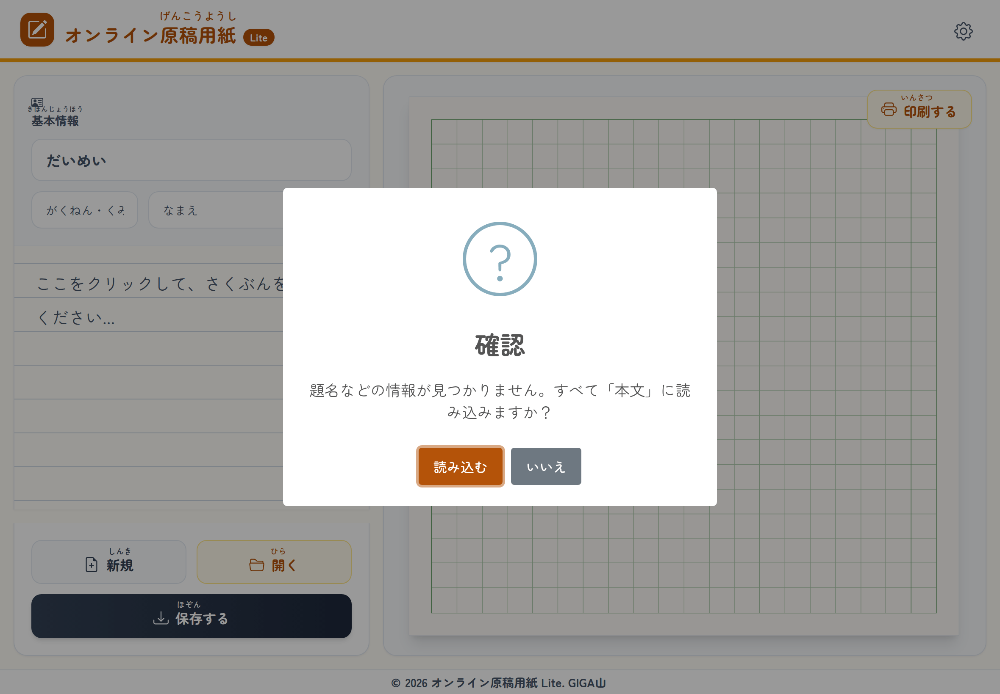

「<ruby>読<rt>よ</rt></ruby>み<ruby>込<rt>こ</rt></ruby>む」を おすと <ruby>全部<rt>ぜんぶ</rt></ruby>が 本文に なります。

「<ruby>読<rt>よ</rt></ruby>み<ruby>込<rt>こ</rt></ruby>む」を おすと、ファイルの <ruby>中身<rt>なかみ</rt></ruby>が すべて 本文に 入ります。だいめいと がくねん・くみと なまえは、いま 入って いる ものが そのまま のこります。じぶんで <ruby>打<rt>う</rt></ruby>ち<ruby>直<rt>なお</rt></ruby>して ください。やめる ときは「いいえ」を おします。

## <ruby>紙<rt>かみ</rt></ruby>に <ruby>印刷<rt>いんさつ</rt></ruby>する・PDFに して のこす（先生むけ）

ここは、<ruby>刷<rt>す</rt></ruby>って <ruby>配<rt>くば</rt></ruby>る ときの ところです。子どもが つかう ときは <ruby>読<rt>よ</rt></ruby>まなくて かまいません。<ruby>刷<rt>す</rt></ruby>った <ruby>紙<rt>かみ</rt></ruby>は、まん中で 二つに おれる <ruby>二段組<rt>にだんぐみ</rt></ruby>の <ruby>原稿用紙<rt>げんこうようし</rt></ruby>に なります。

### 「<ruby>印刷<rt>いんさつ</rt></ruby>する」を おす

1. 右がわの <ruby>原稿用紙<rt>げんこうようし</rt></ruby>の 右上に ある「<ruby>印刷<rt>いんさつ</rt></ruby>する」を おします。
2. ブラウザの <ruby>印刷<rt>いんさつ</rt></ruby>の <ruby>画面<rt>がめん</rt></ruby>が 出ます。
3. 出た <ruby>画面<rt>がめん</rt></ruby>で <ruby>用紙<rt>ようし</rt></ruby>などを たしかめてから <ruby>刷<rt>す</rt></ruby>ります。

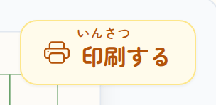

「<ruby>印刷<rt>いんさつ</rt></ruby>する」は ここに あります。

せまい <ruby>画面<rt>がめん</rt></ruby>では、上の「<ruby>原稿用紙<rt>げんこうようし</rt></ruby>をみる」を おしてから でないと この ボタンは 出ません。

### <ruby>印刷<rt>いんさつ</rt></ruby>の <ruby>設定<rt>せってい</rt></ruby>で たしかめる こと

<ruby>印刷<rt>いんさつ</rt></ruby>の <ruby>画面<rt>がめん</rt></ruby>では、つぎの 4つを たしかめて ください。ここを ちがえると、マス目が 出なかったり、小さく なったり します。

1. <ruby>用紙<rt>ようし</rt></ruby>は A4 に します。
2. むきは よこ に します。
3. 大きさは 100パーセント に します。「<ruby>用紙<rt>ようし</rt></ruby>に<ruby>合<rt>あ</rt></ruby>わせる」には しません。
4. <ruby>背景<rt>はいけい</rt></ruby>の グラフィックを 入れます。これが <ruby>切<rt>き</rt></ruby>れて いると <ruby>原稿用紙<rt>げんこうようし</rt></ruby>の マス目が <ruby>刷<rt>す</rt></ruby>られません。

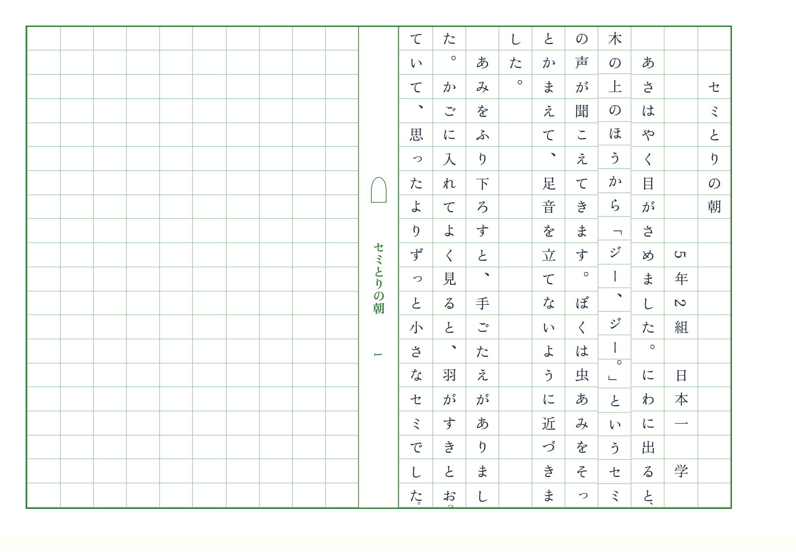

マス目と だいめいが 出て いれば そのまま <ruby>刷<rt>す</rt></ruby>れます。

【！】<ruby>覚<rt>おぼ</rt></ruby>えて おいて ほしい こと:

- <ruby>背景<rt>はいけい</rt></ruby>の グラフィックは、Chrome では「<ruby>詳細設定<rt>しょうさいせってい</rt></ruby>」の 中に あります。
- <ruby>刷<rt>す</rt></ruby>る <ruby>前<rt>まえ</rt></ruby>の 見え<ruby>方<rt>かた</rt></ruby>で マス目が 出て いれば、<ruby>紙<rt>かみ</rt></ruby>にも 出ます。
- <ruby>画面<rt>がめん</rt></ruby>で えらんだ <ruby>用紙<rt>ようし</rt></ruby>の かたちが そのまま <ruby>刷<rt>す</rt></ruby>られます。

### <ruby>刷<rt>す</rt></ruby>り上がりの かたち（<ruby>二段組<rt>にだんぐみ</rt></ruby>と とじしろ）

1まいの <ruby>紙<rt>かみ</rt></ruby>に、<ruby>原稿用紙<rt>げんこうようし</rt></ruby>が 2つ ならびます。まん中には とじしろが あり、たてに だいめいの はじめの 10文字と、ページの <ruby>番号<rt>ばんごう</rt></ruby>が 入ります。だいめいが からの ときは「<ruby>無題<rt>むだい</rt></ruby>」と 出ます。

たてがきなので、右がわの <ruby>段<rt>だん</rt></ruby>から 先に <ruby>読<rt>よ</rt></ruby>みます。右がわが うまると、左がわに つづきます。

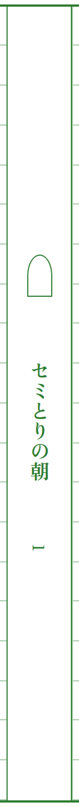

上に ある <ruby>半円<rt>はんえん</rt></ruby>が おり目の しるしです。

### <ruby>文章<rt>ぶんしょう</rt></ruby>が <ruby>長<rt>なが</rt></ruby>い ときは 2まいに つづく

<ruby>書<rt>か</rt></ruby>いた ものが 1まいに 入りきらない ときは、ひとりでに つぎの <ruby>紙<rt>かみ</rt></ruby>に つづきます。ページの <ruby>番号<rt>ばんごう</rt></ruby>は とじしろの ところに 1、2 と 入ります。

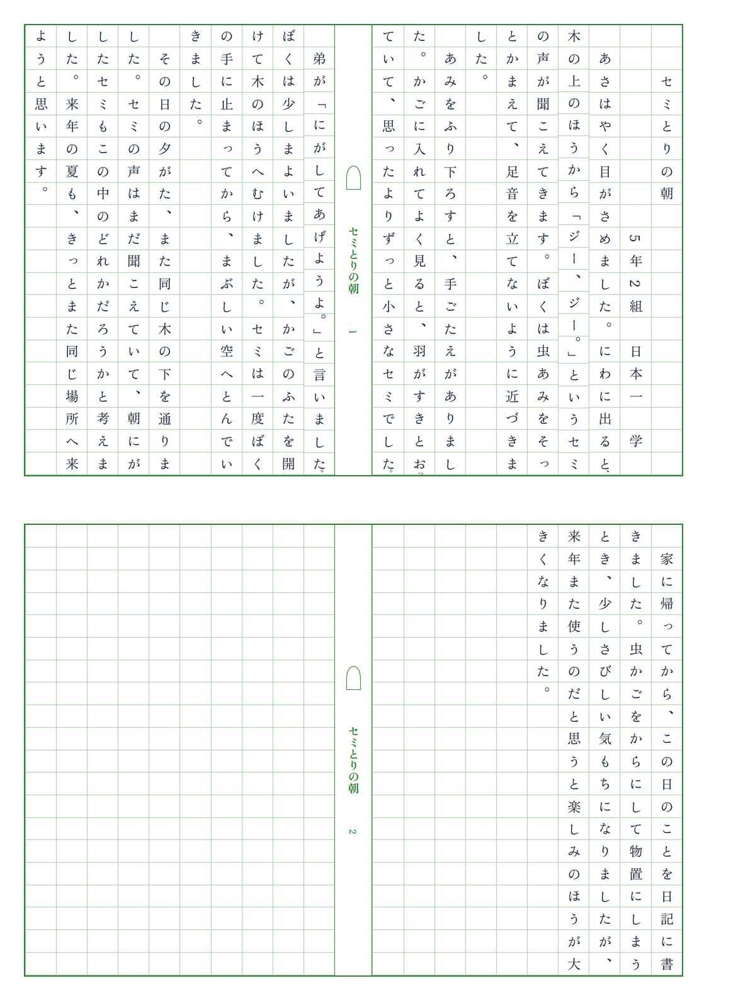

とじしろの <ruby>番号<rt>ばんごう</rt></ruby>が 1 と 2 に なります。

### PDFに して のこす

<ruby>紙<rt>かみ</rt></ruby>に <ruby>刷<rt>す</rt></ruby>らずに、ファイルとして のこす ことも できます。<ruby>印刷<rt>いんさつ</rt></ruby>の <ruby>画面<rt>がめん</rt></ruby>で、<ruby>送<rt>おく</rt></ruby>り先を「PDFに<ruby>保存<rt>ほぞん</rt></ruby>」に して ください。

できた PDF は、そのまま <ruby>配<rt>くば</rt></ruby>ったり、ほかの ところへ うつしたり できます。<ruby>用紙<rt>ようし</rt></ruby>と むきと 大きさの たしかめ<ruby>方<rt>かた</rt></ruby>は、<ruby>紙<rt>かみ</rt></ruby>に <ruby>刷<rt>す</rt></ruby>る ときと <ruby>同<rt>おな</rt></ruby>じです。

## うまく いかない ときは

こまった ことが <ruby>起<rt>お</rt></ruby>きた ときは、ここを 見て ください。上から じゅんに、よく ある ものから ならべて あります。

### 「あたらしい ばんが あります」と 出た とき

アプリが <ruby>新<rt>あたら</rt></ruby>しく なると、<ruby>画面<rt>がめん</rt></ruby>の 下に <ruby>黒<rt>くろ</rt></ruby>い <ruby>帯<rt>おび</rt></ruby>で「あたらしい ばんが あります」と 出ます。おすまで <ruby>切<rt>き</rt></ruby>りかわらないので、あわてなくて だいじょうぶです。

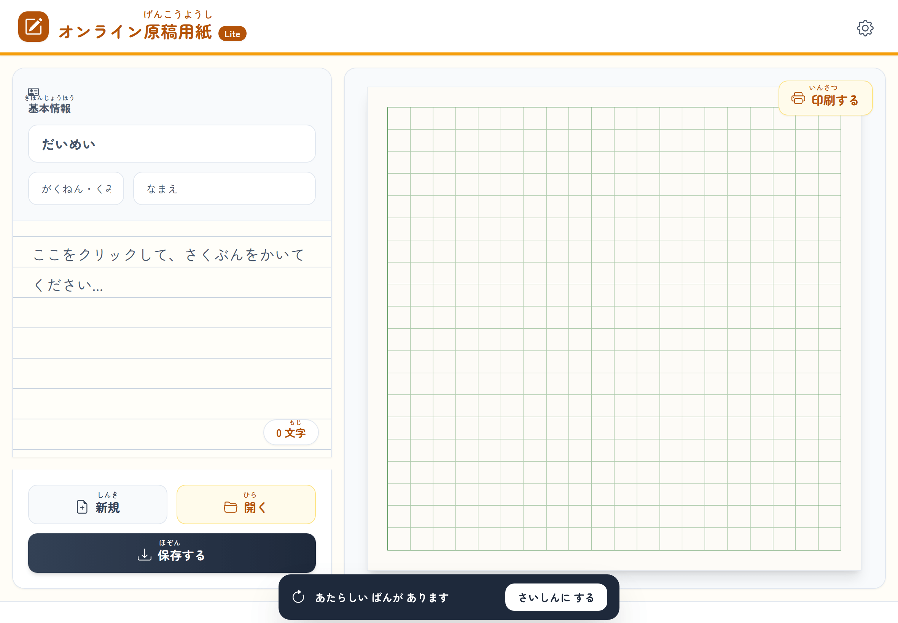

「さいしんに する」を おすと <ruby>新<rt>あたら</rt></ruby>しく なります。

<ruby>書<rt>か</rt></ruby>きかけが ある ときは、先に「<ruby>保存<rt>ほぞん</rt></ruby>する」で <ruby>書<rt>か</rt></ruby>き出してから おして ください。おすと <ruby>画面<rt>がめん</rt></ruby>が <ruby>一度<rt>いちど</rt></ruby> <ruby>読<rt>よ</rt></ruby>みこみ<ruby>直<rt>なお</rt></ruby>されます。

### <ruby>画面<rt>がめん</rt></ruby>が 白い まま 出ない とき

いちど <ruby>閉<rt>と</rt></ruby>じて、もう<ruby>一度<rt>いちど</rt></ruby> ひらいて ください。ブラウザで ひらいて いる ときは、<ruby>読<rt>よ</rt></ruby>みこみ<ruby>直<rt>なお</rt></ruby>しても なおる ことが あります。

それでも 出ない ときは、学校の ネットワークが この ページを <ruby>止<rt>と</rt></ruby>めて いる ことが あります。<ruby>情報<rt>じょうほう</rt></ruby>の 先生に <ruby>聞<rt>き</rt></ruby>いて ください。

### <ruby>書<rt>か</rt></ruby>いた さくぶんが 見あたらない とき

<ruby>同<rt>おな</rt></ruby>じ <ruby>端末<rt>たんまつ</rt></ruby>の <ruby>同<rt>おな</rt></ruby>じ ブラウザで ひらいて いるか たしかめて ください。ほかの <ruby>端末<rt>たんまつ</rt></ruby>、ほかの ブラウザ、ひみつの <ruby>画面<rt>がめん</rt></ruby>では、<ruby>前<rt>まえ</rt></ruby>の <ruby>中身<rt>なかみ</rt></ruby>は 出て きません。

<ruby>前<rt>まえ</rt></ruby>に <ruby>書<rt>か</rt></ruby>いた べつの <ruby>作文<rt>さくぶん</rt></ruby>を 出したい ときも、出て きません。のこるのは 1つだけだからです。<ruby>前<rt>まえ</rt></ruby>の <ruby>作文<rt>さくぶん</rt></ruby>は「<ruby>保存<rt>ほぞん</rt></ruby>する」で ファイルに して おき、「<ruby>開<rt>ひら</rt></ruby>く」で <ruby>読<rt>よ</rt></ruby>みこんで ください。

### 「まだ<ruby>何<rt>なに</rt></ruby>も<ruby>書<rt>か</rt></ruby>いていません」と 出て <ruby>保存<rt>ほぞん</rt></ruby>できない とき

だいめいも 本文も からの ときは、<ruby>書<rt>か</rt></ruby>き出せません。どちらかに <ruby>何<rt>なに</rt></ruby>か <ruby>打<rt>う</rt></ruby>ってから、もう<ruby>一度<rt>いちど</rt></ruby>「<ruby>保存<rt>ほぞん</rt></ruby>する」を おして ください。

<ruby>書<rt>か</rt></ruby>き出せた ときは、ファイルは <ruby>端末<rt>たんまつ</rt></ruby>の「ダウンロード」の ところに 入って います。

### 「<ruby>開<rt>ひら</rt></ruby>く」で ファイルが えらべない とき

えらべるのは 「.txt」の ファイルだけです。Word の <ruby>文書<rt>ぶんしょ</rt></ruby>や PDF は 出て きません。

「<ruby>保存<rt>ほぞん</rt></ruby>する」で <ruby>書<rt>か</rt></ruby>き出した ファイルは、かならず 「.txt」に なって います。<ruby>名前<rt>なまえ</rt></ruby>を かえて しまった ときは、うしろに 「.txt」を つけ<ruby>直<rt>なお</rt></ruby>して ください。

### <ruby>印刷<rt>いんさつ</rt></ruby>で マス目が 出ない とき・小さく なる とき

マス目が 出ない ときは、<ruby>印刷<rt>いんさつ</rt></ruby>の <ruby>設定<rt>せってい</rt></ruby>で「<ruby>背景<rt>はいけい</rt></ruby>のグラフィック」を 入れて ください。Chrome では「<ruby>詳細設定<rt>しょうさいせってい</rt></ruby>」の 中に あります。

小さく なったり、2まいに われたり する ときは、<ruby>用紙<rt>ようし</rt></ruby>が A4 で、むきが よこ で、大きさが 100パーセントに なって いるかを たしかめて ください。

### つながって いない ときの <ruby>画面<rt>がめん</rt></ruby>が 出た とき

「いま インターネットに つながっていません」と 出た ときは、その <ruby>端末<rt>たんまつ</rt></ruby>に アプリが まだ とどいて いない <ruby>状態<rt>じょうたい</rt></ruby>です。

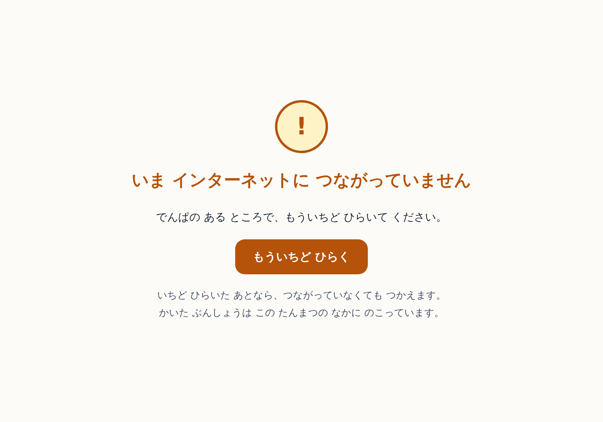

<ruby>電波<rt>でんぱ</rt></ruby>の ある ところで <ruby>一度<rt>いちど</rt></ruby> ひらきます。

<ruby>一度<rt>いちど</rt></ruby> ひらいて おけば、つぎからは つながって いなくても つかえます。

### 字の <ruby>形<rt>かたち</rt></ruby>が いつもと ちがう とき

学校の ネットワークが 字の データを <ruby>止<rt>と</rt></ruby>めて いる ことが あります。字の <ruby>形<rt>かたち</rt></ruby>が かわるだけで、はたらきには えいきょうしません。その まま つかえます。

### それでも なおらない ときは

まず、この アプリを <ruby>教<rt>おし</rt></ruby>えて くれた 先生や、学校の <ruby>情報<rt>じょうほう</rt></ruby>の 先生に <ruby>聞<rt>き</rt></ruby>いて ください。<ruby>同<rt>おな</rt></ruby>じ <ruby>端末<rt>たんまつ</rt></ruby>を つかって いる 人なら、すぐに <ruby>分<rt>わ</rt></ruby>かる ことが <ruby>多<rt>おお</rt></ruby>いです。

それでも <ruby>分<rt>わ</rt></ruby>からない ときは、この ページの 下に ある <ruby>問<rt>と</rt></ruby>い<ruby>合<rt>あ</rt></ruby>わせ先を 見て ください。

<ruby>児童<rt>じどう</rt></ruby>の <ruby>端末<rt>たんまつ</rt></ruby>では、アプリを <ruby>一度<rt>いちど</rt></ruby> <ruby>消<rt>け</rt></ruby>してから 入れ<ruby>直<rt>なお</rt></ruby>すと なおる ことが あります。その ときは <ruby>書<rt>か</rt></ruby>きかけの <ruby>作文<rt>さくぶん</rt></ruby>が <ruby>消<rt>き</rt></ruby>えるので、先に「<ruby>保存<rt>ほぞん</rt></ruby>する」で ファイルに <ruby>書<rt>か</rt></ruby>き出してから 入れ<ruby>直<rt>なお</rt></ruby>して ください。
