# 教室で使えるかもしれないもの作り #◯ 「書き直し」で作文がきらいになる前に。打てば縦書きになる原稿用紙アプリ「オンライン原稿用紙 Lite」

## 🏫 はじめに

作文の時間、子どもたちが手を止めるのは、書くことが思いつかないときだけではありません。行の頭に「。」が来てしまった、かぎかっこの位置がずれた、一行まるごと書き直しになった。そういう理由で止まっている子が、教室にいませんか。

消しゴムを使うたびに紙が薄くなって、気持ちも一緒にしぼんでいきます。清書までたどりつく前に、書くことそのものがきらいになってしまう子がいるのは、もったいないと思います。

かといって、タブレットのメモ帳に打たせるだけでは、原稿用紙の形が身につきません。マスの数の感覚も、句読点をどこに置くかの感覚も、縦に組まれた紙の上でしか育たない気がしています。

その両方をなんとかしたくて作ったのが「オンライン原稿用紙 Lite」です。左の枠に打つと、右の原稿用紙に縦書きで出ます。行の頭に句読点が来ないような調整は、アプリのほうで勝手にやります。そのまま印刷すれば、A4の横向きで二段組の原稿用紙になります。

サーバーもアカウントもありません。配られたアドレスを開くだけで始まります。

https://online-manuscript-paper-lite.giga-school.com/

名前に Lite と付けたのは、機能を削ったことをはっきりさせておきたかったからです。クラウドへの保存、提出の集約、端末をまたいだ同期。あったら便利なものを全部落として、書いて印刷するところだけを残しました。落としたぶん、導入の相談も、個人情報の相談も短くなります。この判断が正しいかどうかは使ってみないと分かりませんが、まず一時間の授業で使えることを先に取りました。

## 📱 このアプリでできること

開くとこの画面が出ます。左が打つところ、右が原稿用紙です。

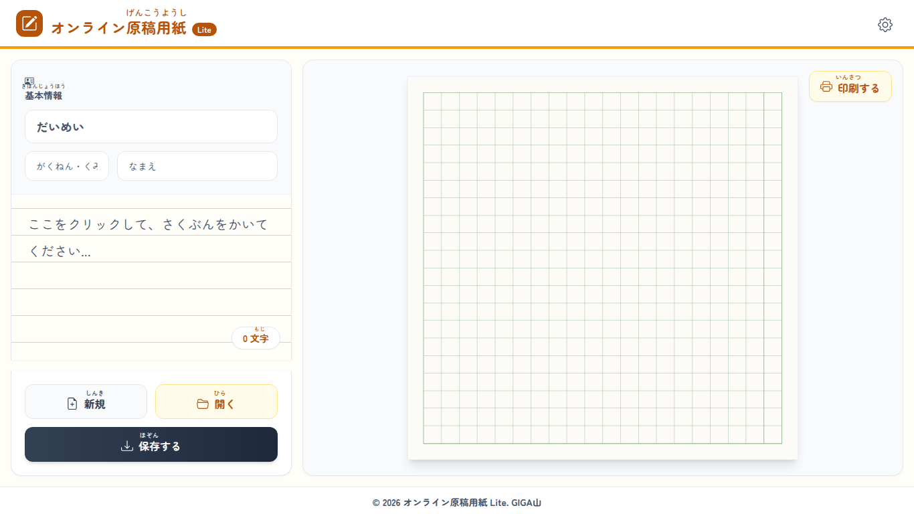

左上に「だいめい」「がくねん・くみ」「なまえ」の欄があり、その下の大きな枠が本文です。欄の名前がひらがななのは、低学年の子が自分で読めるようにするためです。「原稿用紙」「基本情報」「新規」「保存」のように漢字が出るところには、小さくふりがなを振ってあります。読めない言葉が一つあるだけで手が止まる子がいるので、ここは全部の画面で振りました。

本文の枠には、行の高さに合わせた薄い罫線を引いてあります。ノートに書くときと同じで、いま何行目を書いているのかが分かるようにしたかったからです。

打ち始めると、右の原稿用紙にすぐ出ます。

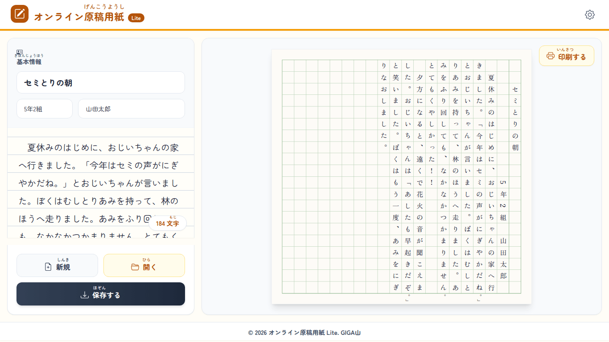

題名は自動で頭から2マス下がります。学年と組、名前は次の行の下のほうに、行の終わりから1マス空けて入ります。子どもが位置を気にする必要はありません。ここを手で調整させていた時間が、そのまま書く時間に変わります。

右下に文字数が出ます。この画面は184文字です。改行は数えていません。原稿用紙の400字と見比べられるようにしたかったので、あえてそうしました。「あと何マス」を子どもが自分で見られると、書き終わりの見通しが立ちます。

左の枠と右の原稿用紙は、スクロールが連動します。どちらを動かしても、もう一方が同じところへ動くので、打っている場所と原稿用紙の場所が離れません。

画面のせまい端末では、上に「かく」と「原稿用紙をみる」のタブが出て、どちらも画面いっぱいに大きく表示されます。

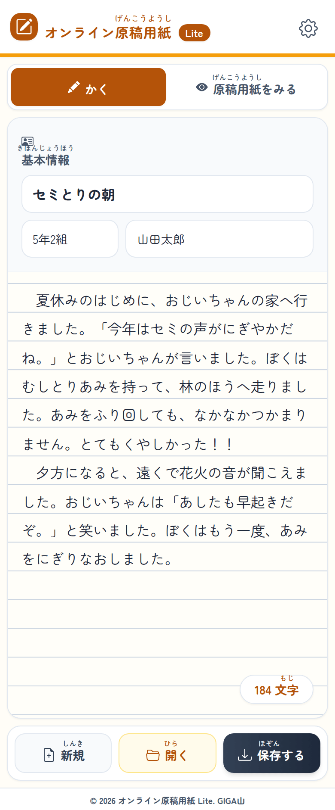

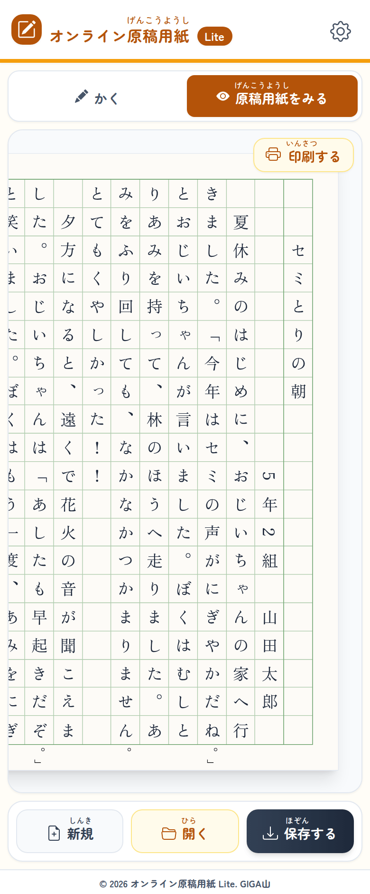

原稿用紙のマスは、この大きさなら低学年でも一字ずつ追えると思います。指で横に動かすと、先の行が見えます。

用紙は2種類あります。高学年向けの20字×20行で400マス、低学年向けの15字×16行で240マスです。右上の歯車から切り替えます。

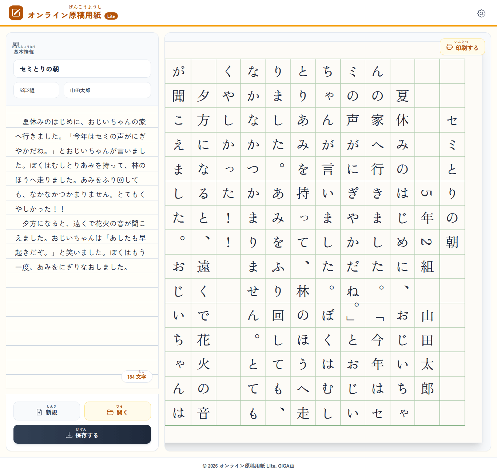

低学年向けのほうはマスが大きくなり、一字が読みやすくなります。学年で使い分けてください。

打った内容は、手が止まってから1秒ほどで、その端末の中に自動でしまわれます。うっかり閉じても、次に開いたときに続きから始まります。

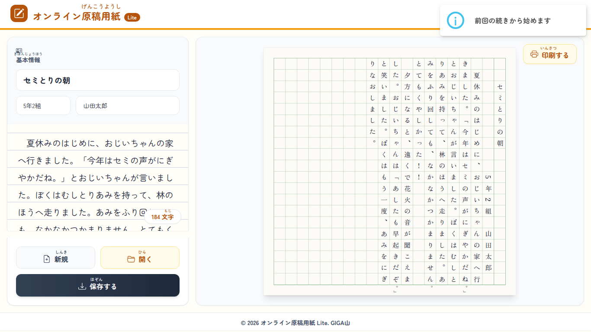

提出用にファイルとして残したいときは「保存する」を押します。「だいめい_なまえ.txt」という名前のファイルが端末に書き出されます。私が試したときは「セミとりの朝_山田太郎.txt」という名前で、大きさは658バイトでした。Google ドライブや Teams に出させることもできます。

中身はふつうの文字だけのファイルです。1行目に題名、2行目に学年と組、3行目に名前が入り、区切りの線をはさんで本文が続きます。Word でも開けますし、先生が中身を見て手直しすることもできます。あとから何かのアプリに読み込ませたくなったときに困らないよう、独自の形にはしませんでした。

書き出したファイルは「開く」から読み込めます。

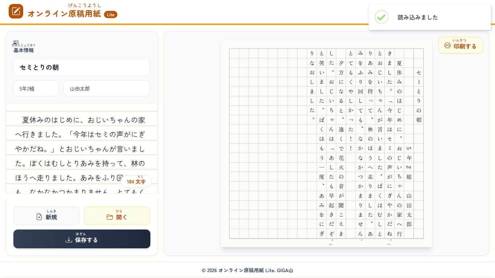

読み込むと、題名と学年と名前と本文が、元のところへきちんと戻ります。段落のはじめの一マス空けも、そのまま残ります。ここは開き直したときに形が変わってしまわないよう、あとから直したところです。

「新規」を押すと、いま書いているものを消してまっさらにできます。押した瞬間に消えると困るので、確認をはさんでいます。

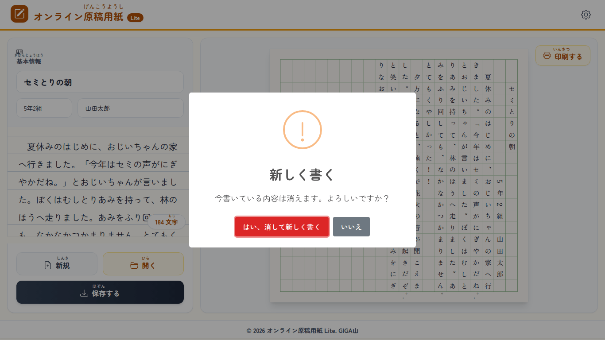

何も書いていないのに「保存する」を押したときは、空のファイルを作らずに知らせます。

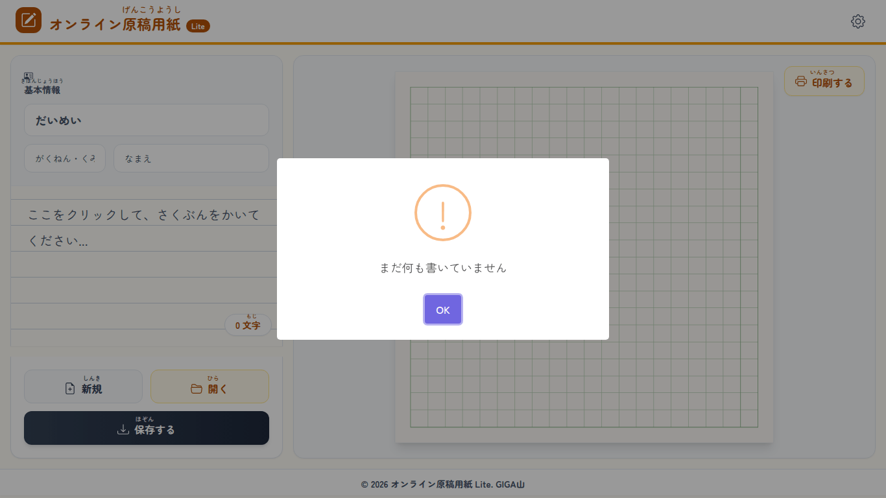

## ✍️ 禁則処理は、アプリのほうでやる

このアプリで一番手をかけたのは、行の頭と終わりの調整です。国語で「禁則処理」と呼ばれているものです。

行の頭に来てはいけない文字を38種類、行の終わりに来てはいけない開きかっこを10種類、それに1マスにまとめて入れる組み合わせを10種類、アプリの中に持っています。子どもが何も知らないまま打っても、原稿用紙の形は崩れません。

1マスにまとめるのは、句点とかぎかっこが並ぶところです。会話文の終わりでは、句点と閉じかっこが同じマスに入ります。ここを2マスに分けてしまうと、そこから先の行が全部一字ずれます。手で書くときは自然にやっていることなので、アプリでも同じにしました。

行の終わりの調整も同じ考え方です。かぎかっこや丸かっこが行の最後のマスに来そうなときは、その一字を待たずに次の行の頭へ送ります。開きかっこだけが行末に取り残された原稿用紙は、印刷して並べたときにすぐ目につきます。

行の頭に句読点が来てしまうときの直しかたは、2つから選べます。歯車を押すと出てきます。

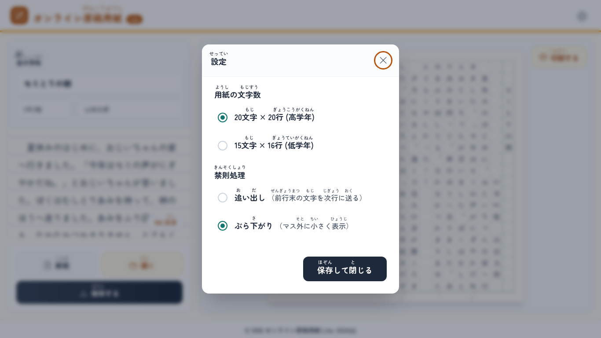

はじめの状態は「ぶら下がり」です。マスの外に小さく出します。

用紙の下のふちに、小さく「。」がはみ出しているのが見えると思います。これがぶら下がりです。

もう一つは「追い出し」です。前の行の最後の1字を次の行の頭に送るので、マスの外に出る字がありません。

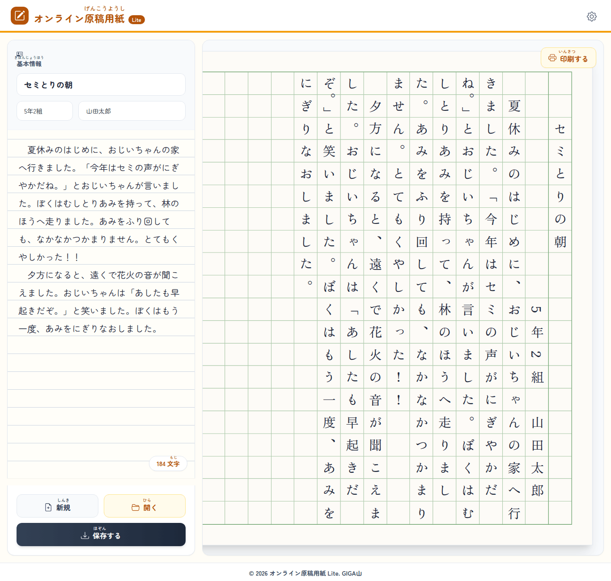

同じ本文でも、行の切れ目が変わります。どちらも国語の教科書で使われている書き方なので、学年や指導に合わせて選んでください。

ぶら下げられるのは2マス分までにしました。「たのしかった！！！！」のように行の頭に置けない文字が続くと、上限がなければ全部がマスの外へ伸びて、印刷したときに用紙の枠からはみ出してしまいます。3マス目からは次の行の頭に置きます。ここは迷ったところで、教科書どおりを取るか、印刷して配れる形を取るかで、後者にしました。

禁則処理を自動にしたのは、教えなくていいと思ったからではありません。順序の話です。まず整った形を見せて、それを見ながら「なぜ『。』が行の頭に来ないのか」を話したほうが、届く子が多い気がしています。清書のたびに一人ずつ赤で直していた時間は、その話に使えます。

## 🖨️ そのままA4の横向きで印刷できる

画面の右上にある「印刷する」を押すと、印刷の画面が出ます。出てくるのはこの形です。

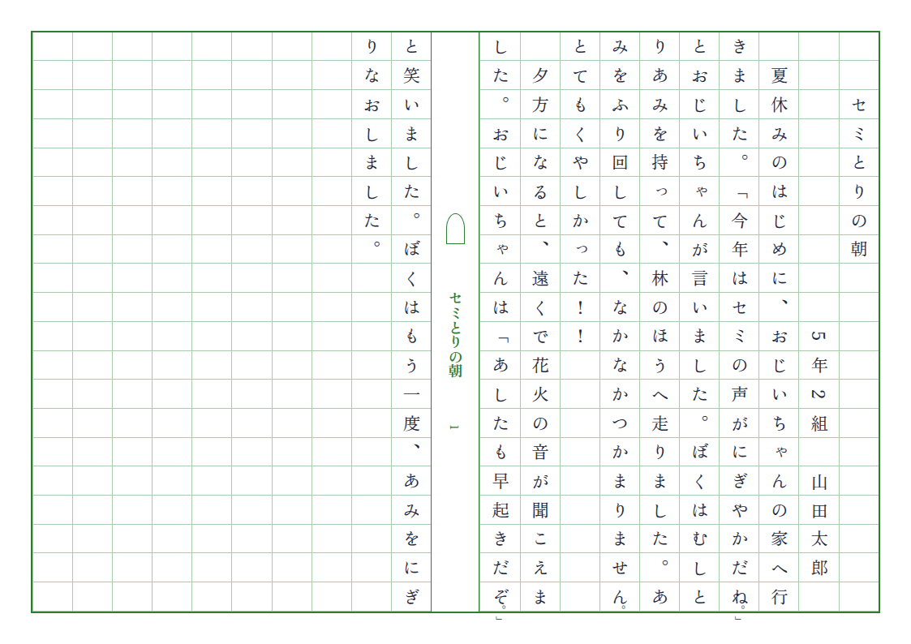

A4の横向きで二段組になります。真ん中には二つ折りにするときの目印があり、そこに題名の先頭10文字とページ番号が入ります。題名が空のときは「無題」と出ます。

本文が長ければ自動で次のページに続きます。415文字の作文で試したときは2ページになり、2枚目の同じところにページ番号の2が入りました。

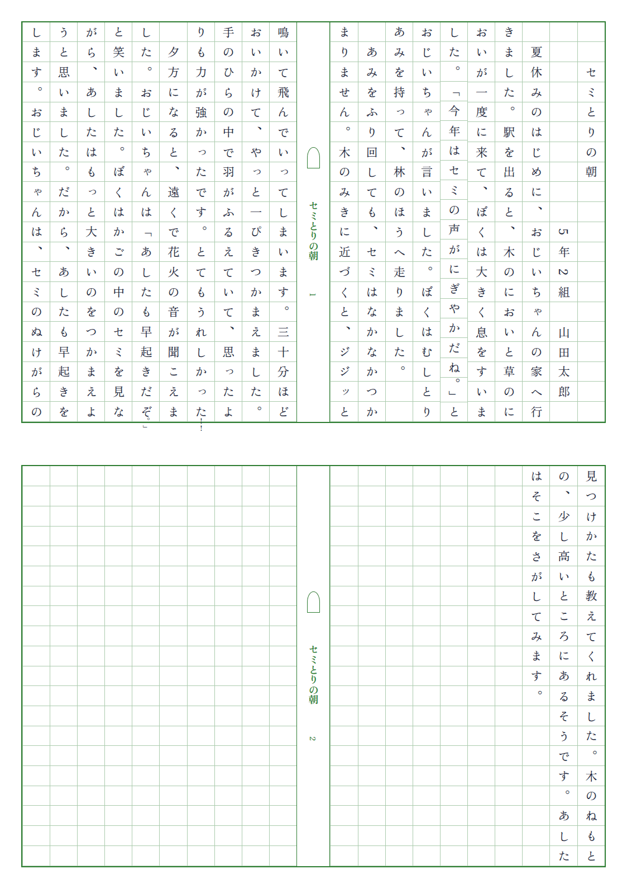

印刷先を「PDFに保存」にすれば、そのまま提出用のPDFにもなります。印刷の設定で気をつけることが一つだけあって、「背景のグラフィック」を入にしないとマス目が出ません。ここは次の管理者向けの節にも書いておきます。

## ✨ 導入のメリット

三つのいいことが期待できます。

一つ目は、丸付けの前の時間が短くなることです。マスのずれを直す、書き直しをさせる、清書させる。作文の指導で使っていた時間のうち、形をそろえるための時間が減ります。減った分は、何を書いたかを読む時間に回せます。

二つ目は、書くことをやめない子が増えるかもしれないことです。一行まるごと書き直しになると、その子はもう一度同じことを書き写すだけの作業に入ります。打ち直しなら数秒です。書き直しが軽いと、直す気持ちも残ります。

三つ目は、準備がいらないことです。原稿用紙を数えて印刷して配るところから始めなくても、アドレスを配れば書き始められます。用紙の在庫を気にしなくていいのは、地味ですが助かる場面が多いと思います。急に一時間空いたときに、その場で作文の時間にできます。

見えにくい子や、書くのに時間がかかる子のための工夫もいくつか入れました。文字の大きさは画面の大きさに合わせて変わります。ブラウザの拡大も止めていません。ボタンはどれも指で押せる大きさにしてあり、文字と背景の濃さも、薄くて読めないところが残らないように一つずつ測って直しました。キーボードだけでも全部の操作に届きます。ソフトキーボードが出たときに入力欄が隠れないよう、見えている高さに画面が追従するようにもしてあります。この手のことは使っている子が自分から言い出さないので、こちら側で先に潰しておくものだと思っています。

## 🛠️ 【管理者向け】導入手順

情報担当の先生に確認されそうなことを、先に全部書いておきます。

配り方は2つあります。一つは、公開したアドレスを子どもたちに配る方法です。GitHub Pages に置けば、そのまま使えます。もう一つは、ファイル一式を端末に配る方法です。Google Classroom や Teams、USBメモリで配って、index.html を開けば動きます。このとき index.html だけでは動かないので、css と js と vendor と icons のフォルダを含めて、まとめて配ってください。

校内のフィルタリングで許可が必要なアドレスは、fonts.googleapis.com と fonts.gstatic.com の2つだけです。これは字の形を整えるためのもので、塞がれていても動きます。塞がれると字の形が端末のものに変わりますが、それ以外は何も変わりません。実行に必要なコードは、外部から一切取ってきません。学校のネットワークで止められて画面が真っ白になる、という状態を避けるためにそうしました。最初に読み込む量は254キロバイトで、40人が同時に開くことを想定した大きさに収めています。

個人情報については、はっきり書きます。入力された名前や学年、作文の中身は、その端末のブラウザの中だけに残ります。どこにも送りません。先生や管理者が集めて見る仕組みもありません。共用端末で使う場合は、授業の終わりに「新規」を押して消してから返させてください。

アプリとして端末に入れる機能と、つながっていなくても使える機能は、HTTPSのアドレスで開いたときだけ働きます。ファイルを直接開いた場合は、この2つは働きませんが、書く、保存する、印刷するはできます。

iPad と iPhone では「インストール」ボタンが出ません。共有ボタンから「ホーム画面に追加」を選んでください。あわせて一つ注意があります。Safari は7日間まったく開かないと、端末の中にしまってある作文を消してしまうことがあります。ホーム画面に追加しておくと起きにくくなりますが、大事な作文はその日のうちに「保存する」でファイルに書き出してください。

Chromebook はメモリが足りなくなるとタブを黙って捨てることがあります。1秒後の自動保存だけでは直前の数文字が消えるので、画面を離れる合図でもう一度しまうようにしてあります。

新しい版を出したときは、画面の下にこの案内が出ます。

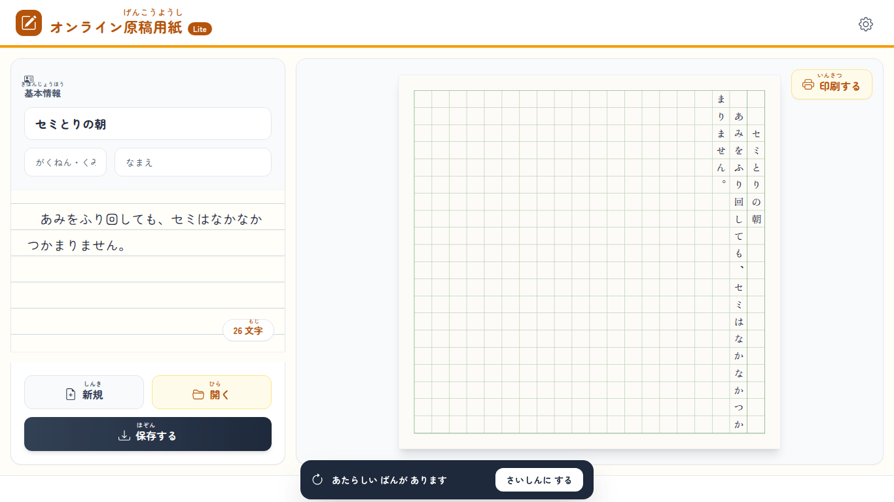

押すまで切り替わりません。書いている最中に中身が入れ替わって、打ちかけの作文が消えるのを避けたかったからです。授業中に出たら、保存してから押させてください。

つながっていない状態で、まだ一度もその端末に読み込めていないときは、この画面が出ます。

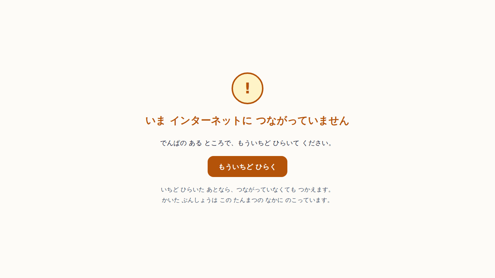

一度開いてしまえば、次からはつながっていなくても使えます。

印刷の設定は、用紙をA4、向きを横、倍率を100%にして、背景のグラフィックを入にしてください。背景のグラフィックが切れているとマス目が印刷されません。ここが一番多い問い合わせになると思います。倍率を「用紙に合わせる」にすると、マスの大きさが変わって原稿用紙として使えなくなるので、そこも見てください。

そのほか、聞かれそうなことをまとめておきます。画面が真っ白のまま出ないときは、いったん閉じてもう一度開いてください。それでも出ないなら、学校のネットワークがそのページを止めていないかを見ます。字の形がいつもと違うときは、文字のデータが止められています。動きには影響しないので、そのまま使えます。書いたはずの作文が出てこないときは、同じ端末の同じブラウザで開いているかを確かめてください。別の端末やシークレットウィンドウでは前の内容は出ません。前に書いた別の作文を探している場合は、持てるのが一つだけなので、前のものはファイルに書き出してから「開く」で読み込む形になります。

できないこともはっきり書いておきます。クラウドへの直接の保存や提出の機能はありません。端末をまたいだ同期もないので、家の端末で書いた続きを学校で開くことはできません。先生が作文を集めて見る仕組みもありません。持てる作文は一つだけで、別の作文はファイルに書き出して残す形になります。本文に太字や色、ふりがなを付けることもできません。扱えるのは文字だけです。

このあたりを削って軽くしたので、サーバーの用意も、アカウントの管理も要らなくなっています。何を捨てたかを分かって使ってもらえるとありがたいです。

## 📖 【利用者向け】使い方のガイド

子どもたちに伝える手順です。そのまま読み上げても通るように書きました。

1. 配られたリンクを開きます。
2. 「だいめい」「がくねん・くみ」「なまえ」を入れます。
3. 大きな枠に作文を打ちます。右の原稿用紙にすぐ出ます。
4. 画面がせまくて原稿用紙が見えないときは、上の「かく」と「原稿用紙をみる」を押して切り替えます。
5. 打った内容は1秒ほどで自動的にしまわれます。何も押さなくてかまいません。
6. 提出用のファイルがほしいときは「保存する」を押します。端末の「ダウンロード」のところに「だいめい_なまえ.txt」ができます。
7. 別の日に続きを書くときは、同じ端末で開き直すか、「保存する」で作ったファイルを「開く」から選びます。
8. 印刷するときは「印刷する」を押して、用紙をA4、向きを横、倍率を100%、背景のグラフィックを入にします。
9. 新しく書き始めるときは「新規」を押します。いま書いているものは消えるので、確認が出ます。

用紙の大きさと、行の頭の直しかたを変えるのは先生の側です。右上の歯車から選んで「保存して閉じる」を押すと、次に開いたときも同じ設定で始まります。

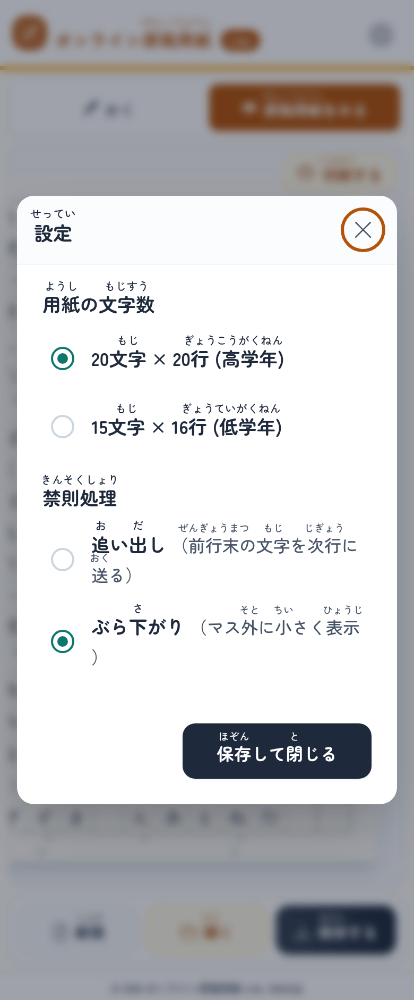

一つだけ、子どもたちがつまずきそうなところがあります。ほかのアプリで書いたメモを「開く」で読み込むと、題名などの情報が見つからないので、全部を本文として読み込むかどうかを聞きます。

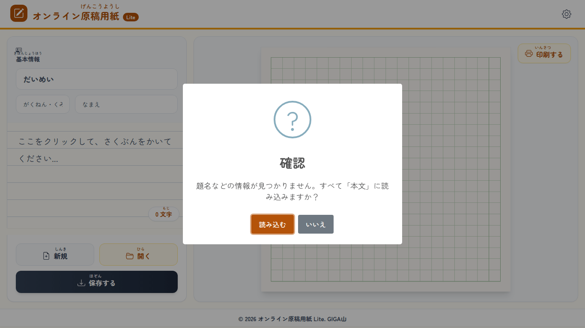

ここで「読み込む」を押せば、文章はそのまま本文に入ります。題名と名前は自分で入れ直してもらってください。

## 📝 まとめ

このアプリでできることは、結局のところ、マスをそろえることと印刷することだけです。作文がうまくなる仕組みは入っていません。

それでも作ったのは、形をそろえるために使われている時間が、思っていたよりずっと長いと感じたからです。行の頭の「。」を直すために赤を入れて回る時間、清書させて集める時間、原稿用紙を数えて印刷する時間。そこを機械に渡せたら、その分だけ、子どもが何を書いたかを読む時間が増えるはずです。

効率化そのものが目的ではありません。「羽がふるえていた」と書けた子がいたときに、そこを書けたことをちゃんと伝えられる。その時間が残ることのほうが、ずっと大事だと思っています。

うまくいくかどうかは、正直なところ、使ってみないと分かりません。合わないところが出てきたら教えてください。直せるものは直します。

一歩踏み出そうとする先生を、私はいつでも全力で応援しています。
